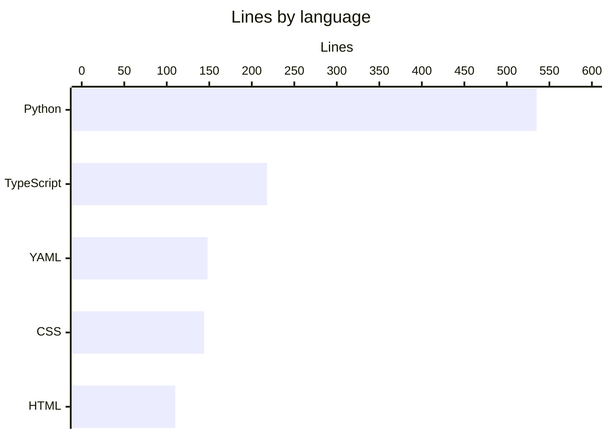

# By the numbers

Data collected on 2026-10-08 from commit `e878c1f` on `main`.

## Size

Code counts exclude `package-lock.json` (1,204 lines) and the wiki under `droid-wiki/`.

| Metric | Value |
| --- | --- |
| Source files | 6 (5 app files, 1 Python publishing script) |
| Test files | 0 |
| Config files | 9 |
| Docs | `README.md` plus 29 wiki pages in `droid-wiki/` |
| Tracked files (all) | 46 |
| Total lines | 1,233 |
| Total bytes | 52,881 |
| Lines that ship in the app | 465 (`index.html` plus `src/`) |
| Runtime dependencies | 0 npm packages, 1 external font stylesheet |
| Dev dependencies | 2 direct (`typescript`, `vite`), 61 packages in `package-lock.json` |

| Language | Files | Lines |
| --- | --- | --- |
| Python | `.github/scripts/publish_confluence.py` | 535 |
| TypeScript | `src/main.ts`, `src/data.ts`, `src/geometry.ts`, `vite.config.ts` | 218 |
| YAML | `.github/workflows/publish-wiki-to-confluence.yml`, `.github/workflows/deploy-pages.yml` | 148 |
| CSS | `src/styles.css` | 144 |
| HTML | `index.html` | 110 |
| JSON | `package.json`, `tsconfig.json`, `.github/scripts/puppeteer-config.json` | 37 |
| Other | `README.md`, `.gitignore`, `.github/scripts/requirements.txt` | 41 |

| File | Language | Lines | Bytes |
| --- | --- | --- | --- |
| `.github/scripts/publish_confluence.py` | Python | 535 | 25,330 |
| `src/styles.css` | CSS | 144 | 5,627 |
| `src/main.ts` | TypeScript | 113 | 4,523 |
| `index.html` | HTML | 110 | 4,348 |
| `.github/workflows/publish-wiki-to-confluence.yml` | YAML | 101 | 3,724 |
| `src/data.ts` | TypeScript | 82 | 5,640 |
| `.github/workflows/deploy-pages.yml` | YAML | 47 | 880 |
| `src/geometry.ts` | TypeScript | 16 | 453 |
| `vite.config.ts` | TypeScript | 7 | 193 |

The app itself grew from 404 lines in three files to 465 lines in five. Most of the increase is type annotations, the typed `byId()` lookup, and splitting data and geometry into their own modules.

## Content

| Metric | Value |
| --- | --- |
| Circles | 4 |
| Zones (regions) | 13 |
| Example strings | 39 (3 per zone) |
| Explore buttons | 5 |
| Named functions in `src/` | 9 (`byId`, `el`, `region`, `toSvg`, `zoneForEvent`, `render`, `setZone` in `src/main.ts`; `zoneAt` in `src/geometry.ts`; `isZoneKey` in `src/data.ts`) |
| Exported types | 4 (`CircleKey`, `ZoneKey`, `Circle`, `Zone`) |
| SVG masks generated at load | 18 (4 inclusion, 14 exclusion) |
| CSS custom properties | 10 |
| Media query breakpoints | 2 (900 px, 600 px) |

## Activity

| Metric | Value |
| --- | --- |
| Commits on `main` | 7 (5 regular, 2 merges) |
| Pull requests merged | 2 (#1 on 2026-10-06, #2 on 2026-10-08) |
| First commit | 2026-09-25 |
| Most recent commit | 2026-10-08 |
| Files changed in the last 90 days | All tracked files |

Commits by author date:

| Date | Commits | What happened |
| --- | --- | --- |
| 2026-09-25 | 1 | Original static app |
| 2026-10-01 | 2 | TypeScript and Vite migration, fsevents install script denied |
| 2026-10-06 | 2 | Wiki and Confluence publishing, merged as PR #1 |
| 2026-10-08 | 2 | Pages deploy workflow, PR #2 merge |

The two 2026-10-01 commits were rebased onto `main` on 2026-10-08, so their committer date is 2026-10-08. See [Lore](lore.md).

The history is too short for real churn hotspots. Outside the wiki, the most-touched files are `package.json`, `index.html`, `README.md`, and `.gitignore`, each changed in 2 commits.

## Bot-attributed commits

| Metric | Value |
| --- | --- |
| Non-merge commits with a bot co-author | 4 of 5 (80%) |
| Bot accounts seen | `factory-droid[bot]` |

This counts `Co-authored-by:` trailers that name `factory-droid[bot]`, over non-merge commits only. It is a lower bound on AI-assisted work, because inline assistants leave no trace in git history.

## Complexity

| Metric | Value |
| --- | --- |
| Largest file | `.github/scripts/publish_confluence.py` (535 lines, 34 functions) |
| Largest app file | `src/styles.css` (144 lines); largest TypeScript file is `src/main.ts` (113 lines) |
| Longest function | `main()` in `.github/scripts/publish_confluence.py` (96 lines) |
| Longest app functions | `region()` and `render()` in `src/main.ts` (11 lines each) |
| Import depth | 2 (`src/main.ts` imports `src/geometry.ts`, which imports `src/data.ts`) |
| TODO / FIXME / HACK comments | 0 |

For history behind these numbers, see [Lore](lore.md).
