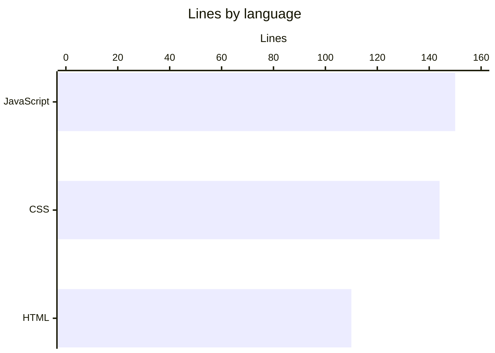

# By the numbers

Data collected on 2026-10-06 from commit `07f52b9` on `main`.

## Size

| Metric | Value |
| --- | --- |
| Source files | 3 |
| Test files | 0 |
| Config files | 0 |
| Total lines | 404 |
| Total bytes | 18,476 |
| Runtime dependencies | 0 npm packages, 1 external font stylesheet |

| File | Language | Lines | Bytes |
| --- | --- | --- | --- |
| `script.js` | JavaScript | 150 | 8,523 |
| `styles.css` | CSS | 144 | 5,627 |
| `index.html` | HTML | 110 | 4,326 |

## Content

| Metric | Value |
| --- | --- |
| Circles | 4 |
| Zones (regions) | 13 |
| Example strings | 39 (3 per zone) |
| Explore buttons | 5 |
| Named functions in `script.js` | 6 (`el`, `region`, `zoneAt`, `toSvg`, `render`, `setZone`) |
| SVG masks generated at load | 18 (4 inclusion, 14 exclusion) |
| CSS custom properties | 10 |
| Media query breakpoints | 2 (900 px, 600 px) |

## Activity

| Metric | Value |
| --- | --- |
| Commits on `main` | 1 |
| First commit | 2026-09-25 |
| Most recent commit | 2026-09-25 |
| Files changed in the last 90 days | 3 of 3 |

With a single commit, there are no churn hotspots yet. Every file was added in that commit.

## Bot-attributed commits

| Metric | Value |
| --- | --- |
| Commits with a bot co-author | 1 of 1 (100%) |
| Bot accounts seen | `factory-droid[bot]` |

This counts `Co-authored-by:` trailers that name an account ending in `[bot]`. It is a lower bound on AI-assisted work, because inline assistants leave no trace in git history.

## Complexity

| Metric | Value |
| --- | --- |
| Average lines per file | 135 |
| Longest file | `script.js` (150 lines) |
| Longest function | `region()` in `script.js` (11 lines) |
| Import depth | 0 (no modules, one global script) |
| TODO / FIXME / HACK comments | 0 |

For history behind these numbers, see [Lore](lore.md).
