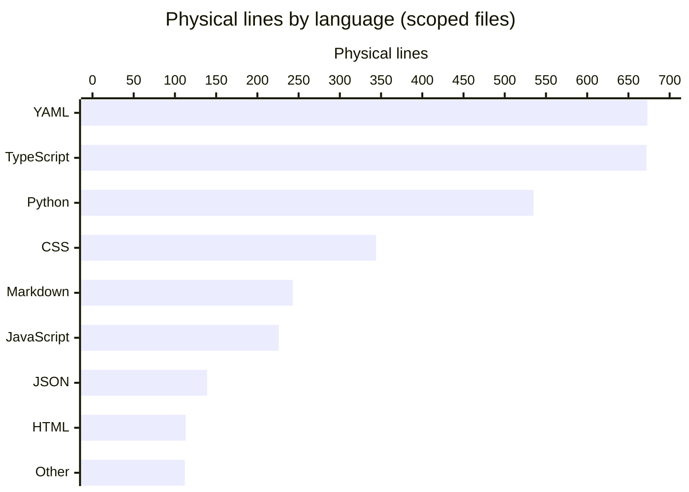

# By the numbers

Snapshot: 2026-10-14, commit `ceb6e4e` on `main` (also `origin/main`). For the story behind the changes, see [Lore](lore.md).

## Size

Counts use git-tracked blobs at this commit, excluding `droid-wiki/`, `package-lock.json`, and generated outputs (none tracked). **Lines are physical lines, including blank lines and comments**, not statements or nonblank code. Bytes are uncompressed file bytes. App-only means `index.html`, `src/data.ts`, `src/geometry.ts`, `src/main.ts`, and `src/styles.css`; adjacent tests do not ship.

| Metric | Value |
| --- | --- |
| Scoped files | 36 |
| Source files | 8: 5 app, 3 automation |
| Test files | 3 |
| Config/support files | 22 (includes workflows, templates, hook, dependency manifests and ignore/env files) |
| Documentation files | 3: `AGENTS.md`, `README.md`, `.github/pull_request_template.md` |
| Total physical lines | 3,057 |
| Total bytes | 118,330 |
| App-only source | 5 files, 800 lines, 21,790 bytes |
| Automation source | 3 files, 761 lines (`.github/scripts/publish_confluence.py` and `scripts/*.mjs`) |
| Tests | 273 lines; 93 expanded cases across 3 test files |
| Config/support | 980 lines |
| Documentation | 243 lines |
| Runtime dependencies | 0 npm packages, 1 external font stylesheet |
| Dev dependencies | 8 direct in `package.json`; 179 non-root package entries in `package-lock.json` |

The lockfile entry count is separate from the size scope and includes platform-specific/optional packages, not just packages installed on one machine. Test counts include expanded `it.each` cases; coverage thresholds are 100% for the two pure runtime modules, not the DOM controller. See [Testing](how-to-contribute/testing.md).

```mermaid
xychart-beta horizontal
    title "Physical lines by language (scoped files)"
    x-axis [YAML, TypeScript, Python, CSS, Markdown, JavaScript, JSON, HTML, Other]
    y-axis "Physical lines" 0 --> 700
    bar [673, 672, 535, 344, 243, 226, 139, 113, 112]
```

| Language | Files | Physical lines |
| --- | --- | --- |
| YAML | 10 | 673 |
| TypeScript | 8 | 672 |
| Python | 1 | 535 |
| CSS | 1 | 344 |
| Markdown | 3 | 243 |
| JavaScript (`.mjs`) | 2 | 226 |
| JSON | 5 | 139 |
| HTML | 1 | 113 |
| Other | 5 | 112 |
| **Total** | **36** | **3,057** |

“Other” comprises `.env.example`, `.github/CODEOWNERS`, `.github/scripts/requirements.txt`, `.gitignore`, and `.husky/pre-commit`. TypeScript includes 343 app lines, 273 test lines and 56 build/test-config lines.

| File | Language | Lines | Bytes |
| --- | --- | --- | --- |
| `.github/scripts/publish_confluence.py` | Python | 535 | 25,330 |
| `src/styles.css` | CSS | 344 | 6,004 |
| `src/main.ts` | TypeScript | 141 | 4,624 |
| `index.html` | HTML | 113 | 4,751 |
| `.github/workflows/publish-wiki-to-confluence.yml` | YAML | 101 | 3,724 |
| `src/data.ts` | TypeScript | 186 | 5,958 |
| `scripts/check-agents-md.mjs` | JavaScript | 148 | 5,673 |
| `.github/workflows/droid-wiki-refresh.yml` | YAML | 140 | 6,274 |
| `.github/workflows/deploy-pages.yml` | YAML | 67 | 1,299 |
| `src/geometry.ts` | TypeScript | 16 | 453 |
| `vite.config.ts` | TypeScript | 7 | 193 |

App source grew from 404 physical lines at the initial commit to 465 after the TypeScript migration, then 800 after formatting. The latest jump is not added runtime functionality.

## Directory averages

Files belong to their immediate parent directory; rows are not recursive. Averages are physical lines per file, rounded to two decimals.

| Directory | Files | Lines | Average lines |
| --- | --- | --- | --- |
| Repository root | 11 | 597 | 54.27 |
| `.github/` | 3 | 139 | 46.33 |
| `.github/ISSUE_TEMPLATE/` | 4 | 207 | 51.75 |
| `.github/scripts/` | 3 | 538 | 179.33 |
| `.github/workflows/` | 5 | 386 | 77.20 |
| `.husky/` | 1 | 4 | 4.00 |
| `scripts/` | 2 | 226 | 113.00 |
| `src/` | 7 | 960 | 137.14 |
| **All scoped files** | **36** | **3,057** | **84.92** |

## Content

| Metric | Value |
| --- | --- |
| Circles | 4 |
| Zones (regions) | 13 |
| Example strings | 39 (3 per zone) |
| Explore buttons | 5 |
| Named runtime functions in `src/` | 9 (`byId`, `el`, `region`, `toSvg`, `zoneForEvent`, `render`, `setZone` in `src/main.ts`; `zoneAt` in `src/geometry.ts`; `isZoneKey` in `src/data.ts`) |
| Exported types | 4 (`CircleKey`, `ZoneKey`, `Circle`, `Zone`) |
| SVG masks generated at load | 18 (4 inclusion, 14 exclusion) |
| CSS custom properties | 10 |
| Media query breakpoints | 2 (900 px, 600 px) |

## Activity

| Metric | Value |
| --- | --- |
| Commits reachable from `origin/main` | 28 (17 non-merges, 11 merges) |
| Pull requests merged | 11 (merge commits; PR numbers #1–#4 and #6–#12) |
| First commit | 2026-09-25 |
| Most recent commit | 2026-10-14 |
| 90-day window | 2026-07-17 through 2026-10-14 inclusive |
| Scoped paths touched in that window | 38 (36 current files and 2 deleted predecessors) |
| 90-day additions / deletions | 3,605 / 548; total churn 4,153 lines |

Activity uses each commit's author-calendar date (its recorded timezone), includes merges, and counts every reachable commit once. Weekly buckets start Monday; September and October are partial months.

| Week starting | Commits |
| --- | --- |
| 2026-09-21 | 1 |
| 2026-09-28 | 2 |
| 2026-10-05 | 9 |
| 2026-10-12 | 16 |
| **Total** | **28** |

| Month | Commits |
| --- | --- |
| 2026-09 | 1 |
| 2026-10 (through 14 Oct) | 27 |

The two 2026-10-01 commits have committer dates of 2026-10-08 after rebasing. Churn uses the same author-date window but **non-merge commits only**, summing `git show --numstat --no-renames` additions and deletions. This avoids merge double-counting and treats migration moves as deletion/addition; it includes historically tracked root JavaScript/CSS files, but excludes the wiki and lockfile throughout. It is not net growth or a behavioral-change measure.

| Path | Additions | Deletions | Touching non-merge commits |
| --- | --- | --- | --- |
| `.github/scripts/publish_confluence.py` | 535 | 0 | 1 |
| `src/styles.css` | 415 | 71 | 2 |
| `index.html` | 206 | 93 | 3 |
| `src/data.ts` | 227 | 41 | 2 |
| `README.md` | 88 | 4 | 6 |
| `AGENTS.md` | 108 | 3 | 5 |
| `package.json` | 45 | 4 | 5 |

The short history, initial additions, moves and one-time formatting dominate these figures; they do not establish long-term maintenance hotspots.

## Bot-attributed commits

| Metric | Value |
| --- | --- |
| Non-merge commits with a bot author or co-author | 8 of 17 (47.06%) |
| Factory Droid attribution | 6 of 17 (35.29%) |
| Dependabot attribution | 2 of 17 (11.76%) |
| Bot accounts seen | `factory-droid[bot]`, `dependabot[bot]` |

Scope is all non-merge history reachable from `origin/main` at the snapshot. Match `[bot]` in the author identity or `Co-authored-by:` identities, and deduplicate by commit even if both match. No merge commits or individual contributor rankings enter the calculation. **Bot attribution is not an AI percentage**: Dependabot is automation, not evidence of generative-AI authorship. The Factory-marked 35.29% is a lower bound on explicitly attributed AI-assisted commits, not on lines written or effort; other agent/assistant use can leave no trailer.

## Complexity

| Metric | Value |
| --- | --- |
| Largest file | `.github/scripts/publish_confluence.py` (535 lines, 34 functions) |
| Largest app file | `src/styles.css` (344 lines); largest runtime TypeScript file is `src/data.ts` (186 lines) |
| Longest function | `main()` in `.github/scripts/publish_confluence.py` (96 lines) |
| Deepest runtime import chain | 2 edges, 3 modules: `src/main.ts` → `src/geometry.ts` → `src/data.ts` |
| Runtime exported symbols | 13: 9 values/functions and 4 types/interfaces |

Runtime exports are `ORDER`, `ZONE_KEYS`, `isZoneKey`, `CIRCLE`, `ZONES`, `EXAMPLES`, `CircleKey`, `ZoneKey`, `Circle`, and `Zone` from `src/data.ts`; `R`, `CENTERS`, and `zoneAt` from `src/geometry.ts`. `src/main.ts` exports nothing. Build/test configuration exports and test helpers are excluded from runtime complexity; the HTML module entry and CSS link are not extra TypeScript import edges. See [Architecture](overview/architecture.md).

For history behind these numbers, see [Lore](lore.md).
