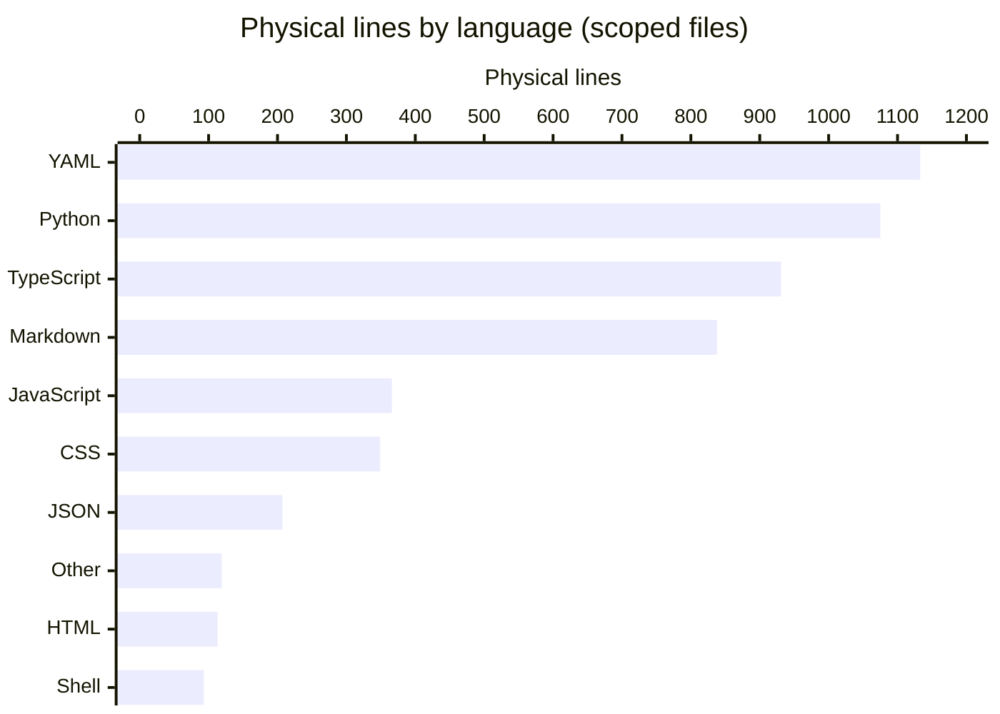

# By the numbers

Data collected on 2026-11-04 from commit `1ddd9dd22051ff35c8b11cc7898b7d805a2b9fef` on `main`. This snapshot separates the unchanged app from its growing developer automation. For the story behind the changes, see [Lore](lore.md).

## Size

Counts enumerate `git ls-tree -r --name-only` at the snapshot and read each blob with `git show <commit>:<path>`, excluding `droid-wiki/` and `package-lock.json`. No generated outputs are tracked. Working-tree edits, concurrent wiki updates and untracked output do not enter the measurements. **Lines are physical lines, including blank lines and comments**, counted with Python `bytes.splitlines()`, not statements or nonblank code. Bytes are uncompressed file bytes. App-only means `index.html`, `src/data.ts`, `src/geometry.ts`, `src/main.ts`, and `src/styles.css`; adjacent tests do not ship.

| Metric | Value |
| --- | --- |
| Scoped files | 55 |
| Source files | 12: 5 app, 7 automation |
| Test files | 5: 4 unit-test files and `e2e/diagram.spec.ts` |
| Config/support files | 30 (includes workflows, walkthrough JSON, issue forms, hook, manifests, ignore/env files and QA YAML/settings) |
| Documentation files | 3: `AGENTS.md`, `README.md`, `.github/pull_request_template.md` |
| QA skill instruction/template files | 3: `.factory/skills/qa/SKILL.md`, `.factory/skills/qa-web/SKILL.md`, `.factory/skills/qa/REPORT-TEMPLATE.md` |
| Walkthrough prompt files | 2: `.github/droid-walkthrough/pass1-candidates.md`, `.github/droid-walkthrough/pass2-validate.md` |
| Total physical lines | 5,224 |
| Total bytes | 220,504 |
| App-only source | 5 files, 805 lines, 21,977 bytes |
| Automation source | 7 files, 1,534 lines, 64,515 bytes (`.github/droid-walkthrough/walkthrough.py`, `.github/scripts/publish_confluence.py`, `scripts/*.mjs` and `scripts/*.sh`) |
| Tests | 509 lines, 20,062 bytes; 160 expanded Vitest cases (93 app, 67 QA report-gate) and 8 Playwright cases |
| Test-to-app line ratio | 0.63 (509 test lines / 805 app lines); this is size, not coverage |
| Config/support | 1,538 lines, 51,771 bytes |
| Documentation | 263 lines, 22,660 bytes |
| QA skill instructions/templates | 412 lines, 32,722 bytes; developer automation instructions, not shipped app source |
| Walkthrough prompts | 163 lines, 6,797 bytes; developer automation instructions, not shipped app source |
| Runtime dependencies | 0 npm packages, 1 external font stylesheet |
| Dev dependencies | 9 direct in `package.json`; 182 non-root package entries in `package-lock.json` |
| Packages | 1 private npm project, not a workspace monorepo |

The roles above are mutually exclusive. Config/support includes the tracked `.factory/skills/qa/.install-progress.yaml`; skill Markdown and walkthrough prompts are counted separately from general documentation. The lockfile entry count is separate from the size scope and includes platform-specific/optional packages, not just packages installed on one machine. Test counts include expanded `it.each` cases. The 67 cases in `scripts/check-qa-report.test.ts` comprise 62 for `evaluateQaReport` and 5 for `checkQaReportFile`, confirmed passing on 2026-10-14 with `npx --no-install vitest run scripts/check-qa-report.test.ts --reporter=dot`. The complete `npm run test:coverage` run then passed all 160 cases, including the unchanged 93 app-unit cases, with 100% coverage of both pure modules. Those are historical results, not validation of this snapshot; this metrics collection did not run tests. Coverage thresholds in `vitest.config.ts` remain 100% for the two pure runtime modules, not the DOM controller or report gate. See [Testing](how-to-contribute/testing.md), [Functional QA](features/functional-qa.md) and [PR walkthrough](features/pr-walkthrough.md).

```mermaid
xychart-beta horizontal
    title "Physical lines by language (scoped files)"
    x-axis [YAML, Python, TypeScript, Markdown, JavaScript, CSS, JSON, Other, HTML, Shell]
    y-axis "Physical lines" 0 --> 1200
    bar [1133, 1075, 931, 838, 366, 349, 207, 119, 113, 93]
```

| Language | Files | Physical lines |
| --- | --- | --- |
| YAML | 15 | 1,133 |
| Python | 2 | 1,075 |
| TypeScript | 11 | 931 |
| Markdown | 8 | 838 |
| JavaScript (`.mjs`) | 3 | 366 |
| CSS | 1 | 349 |
| JSON | 7 | 207 |
| Other | 5 | 119 |
| HTML | 1 | 113 |
| Shell (`.sh`) | 2 | 93 |
| **Total** | **55** | **5,224** |

Languages are classified by extension (`.yml` and `.yaml` together). “Other” comprises `.env.example`, `.github/CODEOWNERS`, `.github/scripts/requirements.txt`, `.gitignore`, and `.husky/pre-commit`. TypeScript includes 343 app lines, 509 test lines and 79 build/test-config lines.

| File | Language | Lines | Bytes |
| --- | --- | --- | --- |
| `.github/droid-walkthrough/walkthrough.py` | Python | 540 | 20,393 |
| `.github/droid-walkthrough/config.json` | JSON | 37 | 1,301 |
| `.github/droid-walkthrough/pass1-candidates.md` | Markdown | 84 | 3,922 |
| `.github/droid-walkthrough/pass2-validate.md` | Markdown | 79 | 2,875 |
| `.github/workflows/droid-walkthrough.yml` | YAML | 85 | 3,182 |
| `.github/scripts/publish_confluence.py` | Python | 535 | 25,330 |
| `src/styles.css` | CSS | 349 | 6,191 |
| `src/main.ts` | TypeScript | 141 | 4,624 |
| `index.html` | HTML | 113 | 4,751 |
| `.github/workflows/publish-wiki-to-confluence.yml` | YAML | 101 | 3,724 |
| `src/data.ts` | TypeScript | 186 | 5,958 |
| `scripts/check-agents-md.mjs` | JavaScript | 148 | 5,673 |
| `.github/workflows/droid-wiki-refresh.yml` | YAML | 140 | 6,274 |
| `.github/workflows/qa.yml` | YAML | 189 | 7,785 |
| `.factory/skills/qa/SKILL.md` | Markdown | 193 | 15,671 |
| `.factory/skills/qa-web/SKILL.md` | Markdown | 198 | 16,644 |
| `.github/workflows/deploy-pages.yml` | YAML | 67 | 1,299 |
| `e2e/diagram.spec.ts` | TypeScript | 70 | 3,008 |
| `playwright.config.ts` | TypeScript | 23 | 746 |
| `.github/workflows/e2e.yml` | YAML | 46 | 1,090 |
| `scripts/check-qa-report.mjs` | JavaScript | 140 | 5,161 |
| `scripts/check-qa-report.test.ts` | TypeScript | 166 | 6,702 |
| `scripts/provision-qa-browser.sh` | Shell | 57 | 2,123 |
| `scripts/run-qa.sh` | Shell | 36 | 2,714 |
| `src/geometry.ts` | TypeScript | 16 | 453 |
| `vite.config.ts` | TypeScript | 7 | 193 |

App source grew from 404 physical lines at the initial commit to 465 after the TypeScript migration, then 800 after formatting and 805 after the Explore-pill focus-ring fix. Relative to the previous snapshot at `2531498`, scoped size increased by 5 files, 825 lines and 31,673 bytes. The PR walkthrough added Python orchestration, two Markdown prompts, JSON configuration and a workflow outside the app. App source, zone content, tests and npm dependencies are unchanged.

## Directory averages

Files belong to their immediate parent directory; rows are not recursive. Averages are physical lines per file, rounded to two decimals.

| Directory | Files | Lines | Average lines |
| --- | --- | --- | --- |
| Repository root | 12 | 665 | 55.42 |
| `.factory/` | 1 | 13 | 13.00 |
| `.factory/skills/qa/` | 4 | 354 | 88.50 |
| `.factory/skills/qa-web/` | 1 | 198 | 198.00 |
| `.github/` | 3 | 139 | 46.33 |
| `.github/ISSUE_TEMPLATE/` | 4 | 207 | 51.75 |
| `.github/droid-walkthrough/` | 4 | 740 | 185.00 |
| `.github/scripts/` | 3 | 538 | 179.33 |
| `.github/workflows/` | 8 | 706 | 88.25 |
| `.husky/` | 1 | 4 | 4.00 |
| `e2e/` | 1 | 70 | 70.00 |
| `scripts/` | 6 | 625 | 104.17 |
| `src/` | 7 | 965 | 137.86 |
| **All scoped files** | **55** | **5,224** | **94.98** |

## Content

| Metric | Value |
| --- | --- |
| Circles | 4 |
| Zones (regions) | 13 |
| Example strings | 39 (3 per zone) |
| Explore buttons | 5 |
| Named runtime functions in `src/` | 9 (`byId`, `el`, `region`, `toSvg`, `zoneForEvent`, `render`, `setZone` in `src/main.ts`; `zoneAt` in `src/geometry.ts`; `isZoneKey` in `src/data.ts`) |
| Exported types | 4 (`CircleKey`, `ZoneKey`, `Circle`, `Zone`) |
| SVG masks generated at load | 18 (4 inclusion, 14 exclusion) |
| CSS custom properties | 10 |
| Media query breakpoints | 2 (900 px, 600 px) |

## Activity

| Metric | Value |
| --- | --- |
| Commits reachable from the `main` snapshot | 43 (25 non-merges, 18 merges) |
| Pull requests merged | 18 (merge commits; PR numbers #1–#4, #6–#17, #19 and #23) |
| First commit | 2026-09-25 |
| Most recent commit | 2026-11-03 |
| 90-day window | 2026-08-07 through 2026-11-04 inclusive |
| Scoped paths touched in that window | 57 (55 current files and 2 deleted predecessors) |
| 90-day additions / deletions | 5,834 / 610; total churn 6,444 lines |

Activity uses each commit's author-calendar date (its recorded timezone), includes merges, and counts every reachable commit once. The collection date is 4 Nov 2026; the newest commits record 3 Nov in UTC−05:00 (4 Nov UTC). Weekly buckets start Monday. Empty weeks and months are omitted; September begins with the first commit, and November is partial.

| Week starting | Commits |
| --- | --- |
| 2026-09-21 | 1 |
| 2026-09-28 | 2 |
| 2026-10-05 | 9 |
| 2026-10-12 | 28 |
| 2026-11-02 | 3 |
| **Total** | **43** |

| Month | Commits |
| --- | --- |
| 2026-09 | 1 |
| 2026-10 | 39 |
| 2026-11 (through 4 Nov) | 3 |

The two 2026-10-01 commits have committer dates of 2026-10-08 after rebasing. Churn uses the same author-date window but **non-merge commits only**, summing `git show --numstat --no-renames` additions and deletions for commits returned by `git rev-list` of the snapshot. This avoids merge double-counting and treats migration moves as deletion/addition; it includes historically tracked root JavaScript/CSS files, but excludes the wiki and lockfile throughout. It is not net growth or a behavioral-change measure. The table lists the ten paths with the largest additions-plus-deletions in that window.

| Path | Additions | Deletions | Touching non-merge commits |
| --- | --- | --- | --- |
| `.github/droid-walkthrough/walkthrough.py` | 540 | 0 | 1 |
| `.github/scripts/publish_confluence.py` | 535 | 0 | 1 |
| `src/styles.css` | 420 | 71 | 3 |
| [script.js](https://github.com/FranklinP44/ikigai/blob/07f52b9/script.js) (removed predecessor) | 150 | 150 | 2 |
| `index.html` | 206 | 93 | 3 |
| [styles.css](https://github.com/FranklinP44/ikigai/blob/07f52b9/styles.css) (removed predecessor) | 144 | 144 | 2 |
| `.github/workflows/qa.yml` | 232 | 43 | 2 |
| `src/data.ts` | 227 | 41 | 2 |
| `.factory/skills/qa-web/SKILL.md` | 198 | 0 | 1 |
| `.factory/skills/qa/SKILL.md` | 195 | 2 | 2 |

Immediate-parent directory totals use the same scope; root-level files are grouped separately, not recursively.

| Directory | Additions | Deletions | Paths touched |
| --- | --- | --- | --- |
| Repository root | 1,074 | 409 | 14 |
| `src/` | 1,091 | 126 | 7 |
| `.github/workflows/` | 767 | 61 | 8 |
| `.github/droid-walkthrough/` | 750 | 10 | 4 |
| `scripts/` | 625 | 0 | 6 |

The short history, initial additions, moves and one-time formatting dominate these figures; they do not establish long-term maintenance hotspots.

## Bot-attributed commits

| Metric | Value |
| --- | --- |
| Non-merge commits with a bot author or co-author | 14 of 25 (56.00%) |
| Factory Droid attribution | 12 of 25 (48.00%) |
| Dependabot attribution | 2 of 25 (8.00%) |
| Bot accounts seen | `factory-droid[bot]`, `dependabot[bot]` |

Scope is all non-merge history reachable from the `main` snapshot. Match `[bot]` in the author identity or `Co-authored-by:` identities, and deduplicate by commit even if both match. No merge commits or individual contributor rankings enter the calculation. **Bot attribution is not an AI percentage**: Dependabot is automation, not evidence of generative-AI authorship. The Factory-marked 48.00% is a lower bound on explicitly attributed AI-assisted commits, not on lines written or effort; other agent/assistant use can leave no trailer.

## Complexity

| Metric | Value |
| --- | --- |
| Average scoped file size | 94.98 physical lines; 4,009.16 bytes (55 files) |
| Average app file size | 161.00 physical lines; 4,395.40 bytes (5 files) |
| Largest file | `.github/droid-walkthrough/walkthrough.py` (540 lines, 35 functions including 2 nested helpers) |
| Largest app file | `src/styles.css` (349 lines); largest runtime TypeScript file is `src/data.ts` (186 lines) |
| Longest function | `main()` in `.github/scripts/publish_confluence.py` (96 lines) |
| Longest walkthrough function | `cmd_post()` in `.github/droid-walkthrough/walkthrough.py` (73 lines) |
| Deepest runtime import chain | 2 edges, 3 modules: `src/main.ts` → `src/geometry.ts` → `src/data.ts` |
| Runtime exported symbols | 13: 9 values/functions and 4 types/interfaces |

Python function counts use `ast.FunctionDef`/`ast.AsyncFunctionDef`; spans run from the definition through the final AST line, inclusive, including intervening comments and blanks. These are size and dependency-depth measures, not cyclomatic complexity.

Runtime exports are `ORDER`, `ZONE_KEYS`, `isZoneKey`, `CIRCLE`, `ZONES`, `EXAMPLES`, `CircleKey`, `ZoneKey`, `Circle`, and `Zone` from `src/data.ts`; `R`, `CENTERS`, and `zoneAt` from `src/geometry.ts`. `src/main.ts` exports nothing. Build/test configuration exports and test helpers are excluded from runtime complexity; the HTML module entry and CSS link are not extra TypeScript import edges. See [Architecture](overview/architecture.md).

For history behind these numbers, see [Lore](lore.md).
