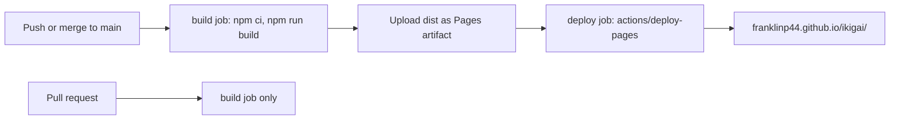

# Deployment

Active contributors: Franklin Pfaller

The site is deployed to GitHub Pages by a GitHub Actions workflow, `.github/workflows/deploy-pages.yml`. Every push to `main` builds the app with Vite and publishes `dist/` to https://franklinp44.github.io/ikigai/. Pull requests run the same build as a check but deploy nothing. A second workflow publishes this wiki to Confluence.

Before PR #2 (merged 2026-10-08), GitHub Pages served the repository root of `main` directly, with no build step. The Pages source is now set to "GitHub Actions".

## Push to live



## The Pages workflow

`.github/workflows/deploy-pages.yml` is named "Build and deploy to GitHub Pages" in the Actions tab.

**Triggers**

| Event | Build | Deploy |
| --- | --- | --- |
| `push` to `main` | Yes | Yes |
| `pull_request` (any branch) | Yes | No |
| `workflow_dispatch` (manual) | Yes | Yes, from the branch you pick |

**Jobs**

1. `build` (ubuntu-latest): `actions/checkout@v4`, `actions/setup-node@v4` with Node 22 and npm caching, `npm ci`, `npm run build` (`tsc --noEmit && vite build`). On non-PR runs, `actions/upload-pages-artifact@v3` uploads `dist` as the Pages artifact.
2. `deploy` (skipped on PRs, needs `build`): runs `actions/deploy-pages@v4` in the `github-pages` environment. The environment URL is the deployed page URL, so the run summary links to the live site.

**Permissions and concurrency**

- The workflow requests `contents: read`, `pages: write`, and `id-token: write`. The last two are what `actions/deploy-pages` needs to publish.
- Runs are grouped by `pages-${{ github.ref }}` with `cancel-in-progress: true`, so a newer push to the same branch cancels an older run that is still going.

**Repository setting**

Under Settings > Pages, "Build and deployment" source must be "GitHub Actions". If it is set to "Deploy from a branch", Pages serves the raw repository files instead, and `index.html` would try to load `/src/main.ts` directly, which browsers cannot run.

## Why `base: './'`

The site lives under a subpath, `/ikigai/`, not at the domain root. By default Vite writes absolute asset URLs such as `/assets/index-<hash>.js`, which would resolve to `https://franklinp44.github.io/assets/...` and return 404, leaving a blank page.

`vite.config.ts` sets `base: './'`, so the built `dist/index.html` references `./assets/index-<hash>.js` and `./assets/index-<hash>.css`. Relative URLs work under any subpath, including `/ikigai/` and `npm run preview` at the root. If the repository is renamed, nothing in the config has to change.

## Pull requests

On a PR the `build` job runs and the artifact upload and `deploy` job are skipped. A green check means the code type-checks and Vite can bundle it. It does not mean the page behaves correctly; run the manual checklist in [Testing](how-to-contribute/testing.md).

## Redeploying

- **Push or merge to `main`.** Any push triggers a build and deploy.
- **Run it manually.** In the Actions tab, open "Build and deploy to GitHub Pages" and choose "Run workflow", or from the terminal:

  ```bash
  gh workflow run deploy-pages.yml -R FranklinP44/ikigai --ref main
  ```

  Running it from a branch other than `main` deploys that branch to the live site, so use `main` unless you mean to.

## Rolling back

Revert the bad commit on `main` and push (or merge a revert PR). The push triggers a normal build and deploy of the reverted code:

```bash
git revert <commit-sha>
git push origin main
```

For a merge commit, add `-m 1` to `git revert`. Re-running an older workflow run from the Actions tab also redeploys that commit's build, but the next push to `main` replaces it, so a revert is the reliable option.

## Publishing the wiki to Confluence

`.github/workflows/publish-wiki-to-confluence.yml` ("Publish wiki to Confluence") runs `.github/scripts/publish_confluence.py`, which converts each page in `droid-wiki/` to Confluence storage format, renders Mermaid blocks to PNG with mermaid-cli, and creates or updates one Confluence page per file under a root page (default title "Ikigai wiki"). Pages are published in the order listed in `pageOrder` in `droid-wiki/.wiki-meta.json`, and only pages listed there are published.

**Triggers**

| Event | Mode |
| --- | --- |
| `push` to `main` touching `droid-wiki/**`, `.github/scripts/**`, or the workflow file | Publish |
| `pull_request` touching the same paths | Dry run |
| `workflow_dispatch` | Publish, or dry run if the `dry_run` input is checked |

A dry run converts pages and renders diagrams into `build/confluence/` without writing to Confluence. If credentials are present, it also authenticates and checks the space read-only. Every run uploads `build/confluence/` as the `confluence-preview` artifact (kept 14 days). Real publishes share one concurrency group and never cancel each other, so two runs cannot write at the same time.

**Configuration** (Settings > Secrets and variables > Actions)

| Name | Kind | Required | Purpose |
| --- | --- | --- | --- |
| `CONFLUENCE_URL` | Variable | Yes | Confluence site URL |
| `CONFLUENCE_SPACE_KEY` | Variable | Yes | Target space key |
| `CONFLUENCE_EMAIL` | Secret | Yes | Atlassian account email |
| `CONFLUENCE_API_TOKEN` | Secret | Yes | API token for that account |
| `CONFLUENCE_ROOT_TITLE` | Variable | No | Root page title (default "Ikigai wiki") |
| `CONFLUENCE_PARENT_ID` | Variable | No | Parent page for the root (default: space homepage) |

A real publish fails if any required value is missing. A dry run only warns and skips the Confluence checks. The workflow checks whether values are set but never prints them; keep it that way, and never echo the email or token in logs or commit them to the repo.

To try the conversion locally, run `python .github/scripts/publish_confluence.py --dry-run` from the repository root after installing `.github/scripts/requirements.txt` and mermaid-cli. Output goes to `build/`, which is gitignored.

## Key source files

| File | Role |
| --- | --- |
| `.github/workflows/deploy-pages.yml` | Builds on every PR and push; deploys `main` to GitHub Pages |
| `vite.config.ts` | Sets `base: './'` so asset URLs work under `/ikigai/` |
| `package.json` | Defines `npm run build` (`tsc --noEmit && vite build`) used by CI |
| `package-lock.json` | Pins dependency versions for `npm ci` |
| `.github/workflows/publish-wiki-to-confluence.yml` | Publishes or dry-runs `droid-wiki/` to Confluence |
| `.github/scripts/publish_confluence.py` | Markdown to Confluence conversion, diagram rendering, page sync |
| `.github/scripts/requirements.txt` | Python dependencies for the publisher |
| `.github/scripts/puppeteer-config.json` | Puppeteer flags (`--no-sandbox`) for mermaid-cli |

## Related pages

- [How to contribute](how-to-contribute/index.md)
- [Tooling](how-to-contribute/tooling.md)
- [Configuration](reference/configuration.md)
