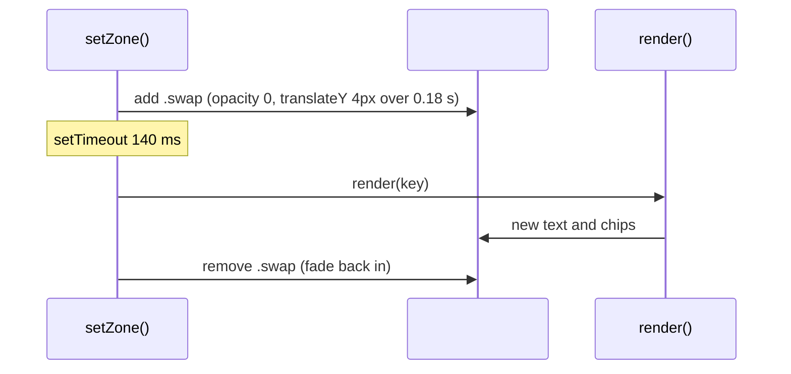

# Detail panel

Active contributors: Franklin Pfaller

## Purpose

The detail panel is the card to the right of the diagram (below it on narrow screens). It explains the active zone: what kind of overlap it is, its name, a description, which circles it belongs to, and three examples of people who live there.

## Directory layout

```text
ikigai/
├── index.html          # aside.panel > .card > #content with #eyebrow, #title, #desc, #chips, #examples
└── src/
    ├── data.ts         # ZONES, EXAMPLES, CIRCLE, ORDER, Zone and Circle interfaces
    ├── main.ts         # byId() lookups, render(), setZone() swap timing
    └── styles.css      # .card, .content.swap, .chip/.chip.off, .examples
```

## Key abstractions

| Name | File | Description |
| --- | --- | --- |
| `render(key)` | `src/main.ts` | Writes the zone's text, chips, and examples into the panel |
| `byId(id, type)` | `src/main.ts` | Typed DOM lookup used for every panel slot; throws `Missing #id` at load if an element is absent or the wrong type |
| `ZONES` | `src/data.ts` | `Record<ZoneKey, Zone>` with `eyebrow`, `title`, and `desc` for each of the 13 zones |
| `EXAMPLES` | `src/data.ts` | `Record<ZoneKey, readonly string[]>`, three example strings per zone |
| `CIRCLE` | `src/data.ts` | `Record<CircleKey, Circle>`, display name and color for each circle, used to build chips |
| `#content` | `index.html` | Wrapper that receives the `.swap` class during transitions |
| `.card` | `index.html` | The panel container; has `aria-live="polite"` |

## How it works

### Rendering

`render(key)` in `src/main.ts` fills five slots:

| Slot | Source | Method |
| --- | --- | --- |
| `#eyebrow` | `ZONES[key].eyebrow` | `textContent` |
| `#title` | `ZONES[key].title` | `textContent` |
| `#desc` | `ZONES[key].desc` | `textContent` |
| `#chips` | `CIRCLE` and the letters in `key` | `innerHTML`, one `<span class="chip">` per circle in `ORDER` |
| `#examples` | `EXAMPLES[key]` | `innerHTML`, one `<li>` per example |

A comment in `render()` notes that the content is static and trusted, and that markup strings were kept so the DOM matches the original page.

Chips always show all four circles, in the same order. Circles that are not part of the zone get the `off` class, which `src/styles.css` renders at 38% opacity with a hollow color dot. This lets the visitor see at a glance which circles a zone combines.

### Swap animation



`setZone()` stores the timeout in `swapTimer` and clears it with `window.clearTimeout()` on every call. If the visitor sweeps across several zones quickly, only the last one renders, which avoids flicker.

At startup, the last line of `src/main.ts` calls `setZone("LGNP", true)`, so the first render skips the fade.

### Layout stability

`.card` has `min-height: 580px` on wide screens so the panel does not jump in height as descriptions and examples change length. At 900 px wide and below, the media query in `src/styles.css` drops the minimum height and stacks the panel under the diagram.

### Accessibility

The card has `aria-live="polite"`, so screen readers announce the new content after a zone change. The SVG has `role="img"` and an `aria-label`. The individual regions are not focusable, so keyboard users can reach only the five Explore buttons.

## Integration points

- Called only through `setZone()` in [Zone exploration](zone-exploration.md).
- Reads the content objects in `src/data.ts` described in [Data models](../reference/data-models.md).
- Chip colors reference the CSS custom properties described in [Visual design](../systems/visual-design.md).

## Entry points for modification

To change copy, edit `ZONES` or `EXAMPLES` in `src/data.ts`. To add a new field to the panel (for example, a reflection question), add the element inside `#content` in `index.html`, look it up with `byId()` in `src/main.ts`, add the field to the `Zone` interface and each `ZONES` entry in `src/data.ts`, and set it in `render()`. Because `ZONES` is typed `Record<ZoneKey, Zone>`, `tsc --noEmit` (run by `npm run build`) fails if any zone is missing the new field. If you ever load content from an outside source, switch the `innerHTML` writes in `render()` to `textContent` or DOM building first (see [Pitfalls](../background/pitfalls.md)).

## Key source files

| File | Purpose |
| --- | --- |
| `src/main.ts` | `render()`, swap timing in `setZone()`, and typed lookups of the panel elements |
| `src/data.ts` | All panel content: `ZONES`, `EXAMPLES`, `CIRCLE` |
| `index.html` | Panel markup, Explore buttons, and the historical note |
| `src/styles.css` | Card, chip, examples, and swap transition styles |
