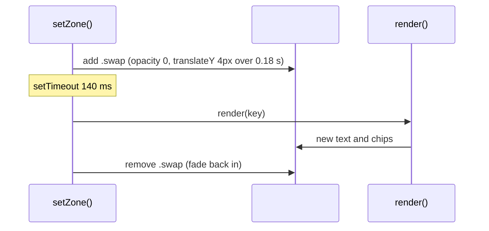

# Detail panel

Active contributors: Franklin Pfaller

## Purpose

The detail panel is the card to the right of the diagram (below it on narrow screens). It explains the active zone: what kind of overlap it is, its name, a description, which circles it belongs to, and three examples of people who live there.

## Directory layout

```text
ikigai/
├── index.html   # aside.panel > .card > #content with #eyebrow, #title, #desc, #chips, #examples
├── script.js    # render(), setZone() swap timing, ZONES, EXAMPLES, CIRCLE
└── styles.css   # .card, .content.swap, .chip/.chip.off, .examples
```

## Key abstractions

| Name | File | Description |
| --- | --- | --- |
| `render(key)` | `script.js` | Writes the zone's text, chips, and examples into the panel |
| `ZONES` | `script.js` | `eyebrow`, `title`, and `desc` for each of the 13 zones |
| `EXAMPLES` | `script.js` | Three example strings per zone |
| `CIRCLE` | `script.js` | Display name and color for each circle, used to build chips |
| `#content` | `index.html` | Wrapper that receives the `.swap` class during transitions |
| `.card` | `index.html` | The panel container; has `aria-live="polite"` |

## How it works

### Rendering

`render(key)` in `script.js` fills five slots:

| Slot | Source | Method |
| --- | --- | --- |
| `#eyebrow` | `ZONES[key].eyebrow` | `textContent` |
| `#title` | `ZONES[key].title` | `textContent` |
| `#desc` | `ZONES[key].desc` | `textContent` |
| `#chips` | `CIRCLE` and the letters in `key` | `innerHTML`, one `<span class="chip">` per circle in `ORDER` |
| `#examples` | `EXAMPLES[key]` | `innerHTML`, one `<li>` per example |

Chips always show all four circles, in the same order. Circles that are not part of the zone get the `off` class, which `styles.css` renders at 38% opacity with a hollow color dot. This lets the visitor see at a glance which circles a zone combines.

### Swap animation



`setZone()` stores the timeout in `swapTimer` and clears it on every call. If the visitor sweeps across several zones quickly, only the last one renders, which avoids flicker.

At startup, `setZone("LGNP", true)` passes `instant = true` so the first render skips the fade.

### Layout stability

`.card` has `min-height: 580px` on wide screens so the panel does not jump in height as descriptions and examples change length. Below 900 px wide, the media query in `styles.css` drops the minimum height and stacks the panel under the diagram.

### Accessibility

The card has `aria-live="polite"`, so screen readers announce the new content after a zone change. The SVG has `role="img"` and an `aria-label`. The individual regions are not focusable, so keyboard users can reach only the five Explore buttons.

## Integration points

- Called only through `setZone()` in [Zone exploration](zone-exploration.md).
- Reads the content objects described in [Data models](../reference/data-models.md).
- Chip colors reference the CSS custom properties described in [Visual design](../systems/visual-design.md).

## Entry points for modification

To change copy, edit `ZONES` or `EXAMPLES` in `script.js`. To add a new field to the panel (for example, a reflection question), add the element inside `#content` in `index.html`, add the data to each `ZONES` entry, and set it in `render()`. If you ever load content from an outside source, switch the `innerHTML` writes in `render()` to `textContent` or DOM building first (see [Pitfalls](../background/pitfalls.md)).

## Key source files

| File | Purpose |
| --- | --- |
| `script.js` | `render()`, swap timing in `setZone()`, and all panel content |
| `index.html` | Panel markup, Explore buttons, and the historical note |
| `styles.css` | Card, chip, examples, and swap transition styles |
