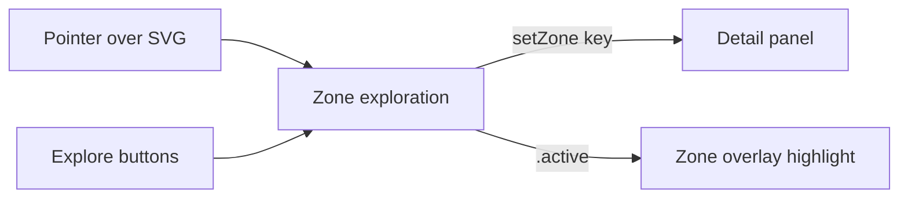

# Features

The app has two user-facing features. Both live in `script.js` and share the same state (`current` and `pinned`).

| Feature | What the visitor does | Page |
| --- | --- | --- |
| Zone exploration | Hovers, taps, or clicks regions of the diagram, or presses an Explore button | [Zone exploration](zone-exploration.md) |
| Detail panel | Reads the eyebrow, title, description, circle chips, and examples for the active zone | [Detail panel](detail-panel.md) |

The visual building blocks these features depend on are covered under [Systems](../systems/index.md).
