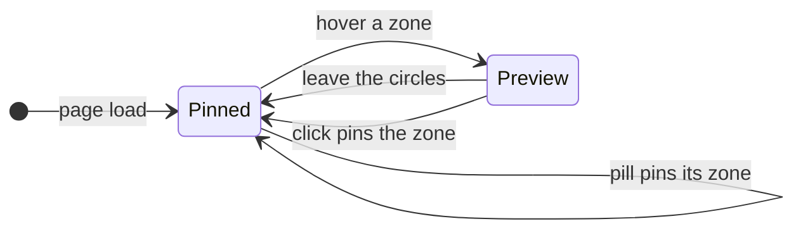

# Zone exploration

Active contributors: Franklin Pfaller

## Purpose

Zone exploration is the core interaction. As the visitor moves the pointer across the diagram, the region under it lights up and the [Detail panel](detail-panel.md) updates. Clicking a region, or pressing one of the Explore buttons, pins that region so it stays selected after the pointer leaves.

## Directory layout

```text
ikigai/
├── index.html   # svg#ikigai and the five .pill buttons
├── script.js    # zoneAt(), toSvg(), setZone(), event listeners
└── styles.css   # .zone / .zone.active, .pill.active, svg.hovering
```

## Key abstractions

| Name | File | Description |
| --- | --- | --- |
| `zoneAt(x, y)` | `script.js` | Returns the zone key for a point in SVG user space, or `null` if the point is outside every circle |
| `toSvg(e)` | `script.js` | Converts a pointer event's `clientX`/`clientY` into SVG user-space coordinates using `getScreenCTM().inverse()` |
| `setZone(key, instant)` | `script.js` | Makes `key` the active zone: toggles `.active` on overlays and pills and triggers the panel swap |
| `current` | `script.js` | The zone currently displayed |
| `pinned` | `script.js` | The zone to return to when the pointer leaves; starts as `LGNP` |
| `zoneEls` | `script.js` | Map from zone key to its generated overlay `<g>` element |
| `.pill[data-zone]` | `index.html` | Explore buttons for `LGNP`, `LG`, `LN`, `GP`, `NP` |

## How it works

### Hit testing

`zoneAt()` loops over `ORDER` (`"LGNP"`) and appends each circle's letter when the point is within radius `R` (200) of that circle's center in `C`. The result is already a valid [zone key](../primitives/zone-keys.md) because the loop runs in canonical order. If the key is not in `ZONES` (only the empty string, for points outside every circle), it returns `null`.

Because hit testing is computed from geometry, the overlay groups in `#zones` never need to receive pointer events. The labels group also has `pointer-events: none` in `styles.css`, so text never blocks hovering.

### Event handling



The four listeners in `script.js`:

| Event | Target | Behavior |
| --- | --- | --- |
| `pointermove` | `svg#ikigai` | Converts coordinates, finds the zone, toggles `svg.hovering` (pointer cursor), and calls `setZone(key || pinned)` |
| `pointerleave` | `svg#ikigai` | Removes `hovering` and calls `setZone(pinned)` |
| `click` | `svg#ikigai` | If the click is inside a zone, sets `pinned` to it and calls `setZone()` |
| `click` | each `.pill` | Sets `pinned` to the pill's `data-zone` and calls `setZone()` |

### Activating a zone

`setZone(key, instant)`:

1. Returns immediately if `key === current`. This makes the frequent `pointermove` calls cheap.
2. Toggles `.active` on the matching overlay in `zoneEls`. In `styles.css`, `.zone` has `opacity: 0` with a 0.22 s transition, and `.zone.active` has `opacity: 1`, so the region brightens.
3. Toggles `.active` on the matching pill (dark fill).
4. Clears any pending swap timer, then either renders immediately (`instant`, used once at startup) or runs the panel fade described in [Detail panel](detail-panel.md).

### Touch devices

The SVG has `touch-action: manipulation` in `styles.css`, which disables double-tap zoom so taps register as clicks right away. A tap fires `click`, which pins the tapped zone.

### Reachability

The five pills cover only the center and the four named pairs. Single-circle zones (`L`, `G`, `N`, `P`) and the three-circle zones (`LGN`, `LNP`, `GNP`, `LGP`) can only be reached through the diagram. The white dots drawn in `index.html` at (400, 291), (509, 400), (400, 509), and (291, 400) sit inside the four three-circle zones to hint where they are.

## Integration points

- Reads geometry (`C`, `R`, `ORDER`) and content keys (`ZONES`) defined at the top of `script.js`. See [Data models](../reference/data-models.md).
- Depends on the overlay groups produced by [Region rendering](../systems/region-rendering.md).
- Drives the [Detail panel](detail-panel.md) through `setZone()`.

## Entry points for modification

To add a new Explore button, add a `<button class="pill" data-zone="KEY">` to `#pills` in `index.html`; the existing listener picks it up. To change what happens on hover versus click, edit the listeners at the bottom of `script.js`. If you change circle positions or the radius, update both `C`/`R` in `script.js` and the `<circle>` attributes in `index.html`, because hit testing uses the JS values and the visible circles use the HTML values (see [Pitfalls](../background/pitfalls.md)).

## Key source files

| File | Purpose |
| --- | --- |
| `script.js` | Hit testing, coordinate conversion, state, and all event listeners |
| `index.html` | The `svg#ikigai` element and the Explore `.pill` buttons |
| `styles.css` | `.zone` fade, `.pill.active` styling, `svg.hovering` cursor, `touch-action` |
