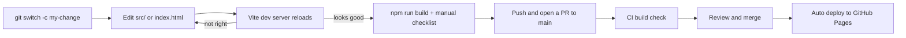

# Development workflow

The loop is edit, save, and let the Vite dev server reload the page. Before opening a PR, run `npm run build` to type-check and produce the production bundle.



## Step by step

1. Install dependencies once (Node.js 20.19+ or 22.12+, per `README.md`):

   ```bash
   npm install
   ```

   `npm ci` also works and installs exactly what `package-lock.json` lists. CI uses `npm ci`.

2. Create a branch:

   ```bash
   git switch -c fix/zone-copy
   ```

3. Start the dev server (see [Getting started](../overview/getting-started.md)):

   ```bash
   npm run dev
   ```

   It serves the page at http://localhost:5173 and reloads it when you save.

4. Edit the relevant file:
   - Copy or examples: `ZONES` and `EXAMPLES` in `src/data.ts`.
   - Circle positions, radius, hit testing: `src/geometry.ts`.
   - Masks, overlays, panel rendering, event handling: `src/main.ts`.
   - Layout, colors, motion: `src/styles.css`.
   - Labels, buttons, or the base SVG: `index.html`.

5. Check the change in the browser. Keep DevTools open to catch console errors.

6. Type-check and build:

   ```bash
   npm run build
   ```

   This runs `tsc --noEmit`, then `vite build` into `dist/`. To check the production bundle, run `npm run preview` and open http://localhost:4173.

7. Run the checklist in [Testing](testing.md).

8. Commit with a conventional prefix and push:

   ```bash
   git commit -am "fix: clarify Vocation description"
   git push -u origin fix/zone-copy
   gh pr create --fill
   ```

9. CI runs the same `npm run build` on the PR. After review and merge, the push to `main` builds and deploys the site to GitHub Pages. See [Deployment](../deployment.md).

## Things to watch

- Circle geometry is defined twice, once in the `<circle>` elements of `index.html` and once in `CENTERS` and `R` in `src/geometry.ts`. Change both together. See [Pitfalls](../background/pitfalls.md).
- The panel is sized for three examples per zone. If you add more, check the card height at desktop width.
- `tsconfig.json` sets `noUnusedLocals` and `noUnusedParameters`, so leftover variables fail the build.
- The wiki in `droid-wiki/` describes the code. Update it in the same PR when you change behavior.
