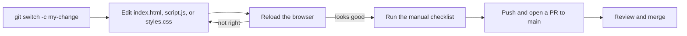

# Development workflow

The loop is edit, save, reload. There is nothing to compile.



## Step by step

1. Create a branch:

   ```bash
   git switch -c fix/zone-copy
   ```

2. Start a local server so reloads behave like a hosted page (see [Getting started](../overview/getting-started.md)):

   ```bash
   python3 -m http.server 8000
   ```

3. Edit the relevant file:
   - Copy or examples: `ZONES` and `EXAMPLES` in `script.js`.
   - Layout, colors, motion: `styles.css`.
   - Labels, buttons, or the base SVG: `index.html`.

4. Reload and check the change. Keep DevTools open to catch console errors.

5. Run the checklist in [Testing](testing.md).

6. Commit with a conventional prefix and push:

   ```bash
   git commit -am "fix: clarify Vocation description"
   git push -u origin fix/zone-copy
   gh pr create --fill
   ```

## Things to watch

- Circle geometry is defined twice, once in `index.html` and once in `script.js`. Change both together. See [Pitfalls](../background/pitfalls.md).
- The panel is sized for three examples per zone. If you add more, check the card height at desktop width.
- The wiki in `droid-wiki/` describes the code. Update it in the same PR when you change behavior.
