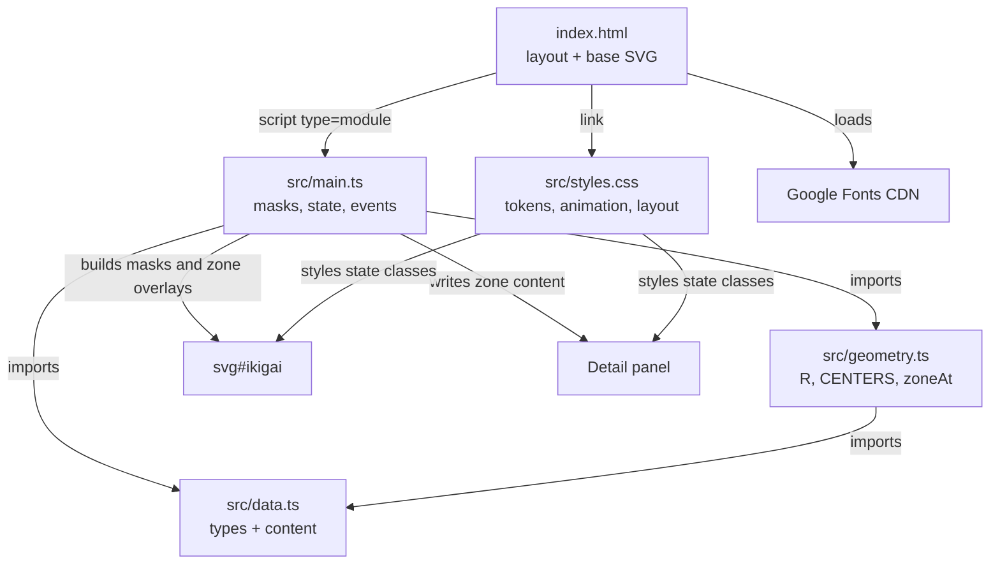
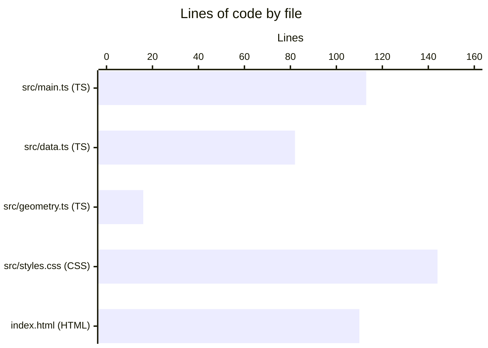
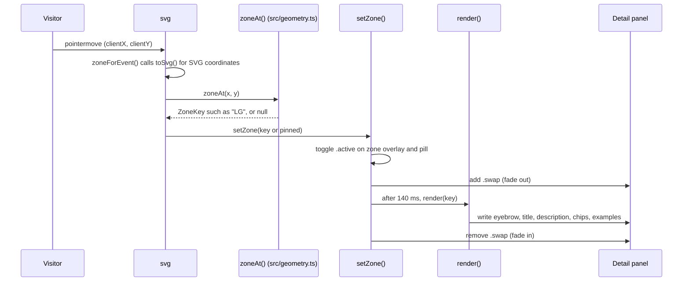

# Architecture

Ikigai is a small TypeScript app bundled by Vite into static files. `index.html` holds the page layout and the base SVG, `src/styles.css` handles the look and animations, and `src/main.ts` builds the overlap regions at load time and wires up the interaction. `src/main.ts` imports its content from `src/data.ts` and its geometry and hit testing from `src/geometry.ts`.

## Components

`index.html` references `/src/styles.css` and `/src/main.ts` directly. In development, the Vite dev server compiles the TypeScript on request. `npm run build` first type-checks with `tsc --noEmit`, then `vite build` bundles everything into `dist/` (an `index.html` plus hashed JS and CSS files under `dist/assets/`) with the tags rewritten to point at the bundles. `vite.config.ts` sets `base: './'` so the asset URLs are relative and work under the GitHub Pages subpath `/ikigai/`. There is no server code. See [Deployment](../deployment.md) for how `dist/` is published.

The entry script is an ES module, so the browser defers it until the document is parsed. `src/main.ts` can look up DOM elements at the top level without waiting for `DOMContentLoaded`.

## Language breakdown

See [By the numbers](../by-the-numbers.md) for the full snapshot.

## SVG layer stack

The diagram in `index.html` is a stack of SVG groups. Later groups paint on top of earlier ones.

| Order | Group | Filled by | Purpose |
| --- | --- | --- | --- |
| 1 | `<g class="circles">` | `index.html` | Four colored circles, blended with `mix-blend-mode: multiply` so overlaps darken naturally |
| 2 | `<g id="centerFill">` | `src/main.ts` | Gold radial gradient painted only inside the four-way overlap |
| 3 | `<g id="zones">` | `src/main.ts` | One translucent white overlay per region, hidden until it becomes active |
| 4 | `<g class="outlines">` | `index.html` | White circle outlines drawn over the fills |
| 5 | `<g class="labels">` | `index.html` | Circle names, pair names, center label, and the four white dots; `pointer-events: none` |

The masks that shape layers 2 and 3 are explained in [Region rendering](../systems/region-rendering.md).

## Request lifecycle: pointer to panel

There are no network requests after load. The interesting flow is how a pointer event updates the page.

Hit testing is pure math: `zoneAt()` in `src/geometry.ts` checks the distance from the point to each circle center and returns a `ZoneKey`, or `null` when the point is outside every circle. It does not rely on DOM hit targets, so the overlapping masked groups never compete for events. See [Zone exploration](../features/zone-exploration.md) for the full interaction model.

## Data model at a glance

All content and its types live in `src/data.ts`:

- `CircleKey` (`"L" | "G" | "N" | "P"`) and `ZoneKey` (a union of the 13 region keys).
- `ORDER`: the four circle keys in `L-G-N-P` order. `ZONE_KEYS`: all 13 zone keys in overlay creation order.
- `CIRCLE: Record<CircleKey, Circle>`: display name and color variable for each circle.
- `ZONES: Record<ZoneKey, Zone>`: eyebrow, title, and description for each region.
- `EXAMPLES: Record<ZoneKey, readonly string[]>`: three example strings for each region.
- `isZoneKey()`: a type guard that narrows a plain string to `ZoneKey`.

Because the records are typed by `ZoneKey`, the compiler rejects a missing or misspelled region. Field-level details are in [Data models](../reference/data-models.md), and the key scheme is in [Zone keys](../primitives/zone-keys.md).

## Key source files

| File | Purpose |
| --- | --- |
| `index.html` | Page layout, base SVG (circles, outlines, labels, gold gradient), detail panel shell, Explore buttons, and the `<script type="module">` entry point |
| `src/main.ts` | Typed DOM lookups, SVG mask generation, panel rendering, state, and event handlers |
| `src/data.ts` | Circle and zone types, zone content, examples, and the `isZoneKey()` guard |
| `src/geometry.ts` | Circle radius `R`, circle `CENTERS`, and the `zoneAt()` hit test |
| `src/styles.css` | Design tokens, entrance animations, zone overlay transitions, panel styling, and responsive breakpoints |
| `vite.config.ts` | Vite settings; `base: './'` for relative asset URLs |
| `tsconfig.json` | Strict TypeScript compiler options for type checking only (`noEmit`) |
| `.github/workflows/deploy-pages.yml` | Builds on every push and PR, deploys `dist/` to GitHub Pages from `main` |
