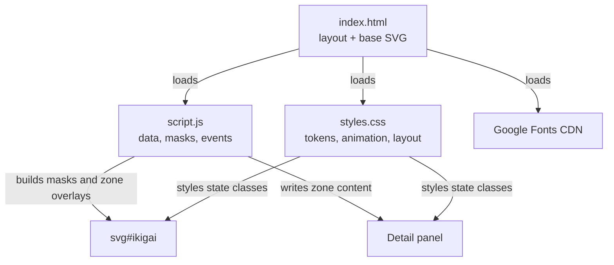
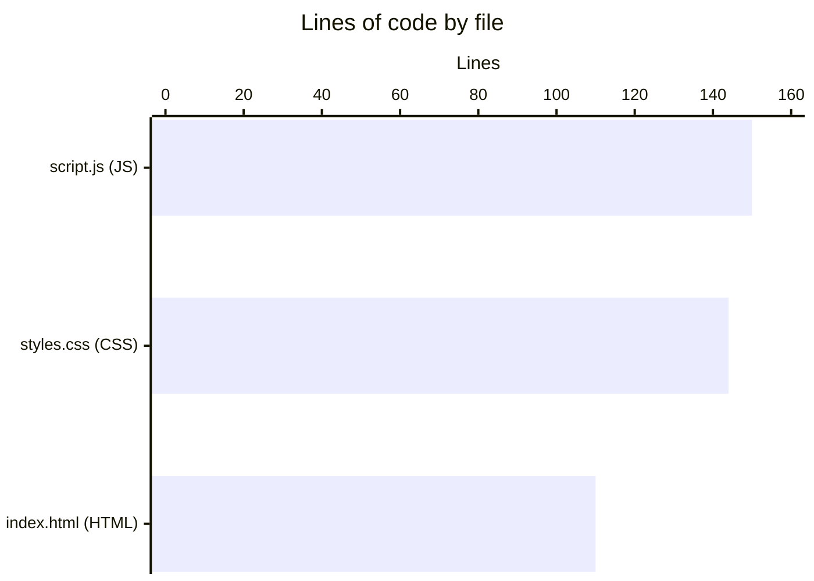
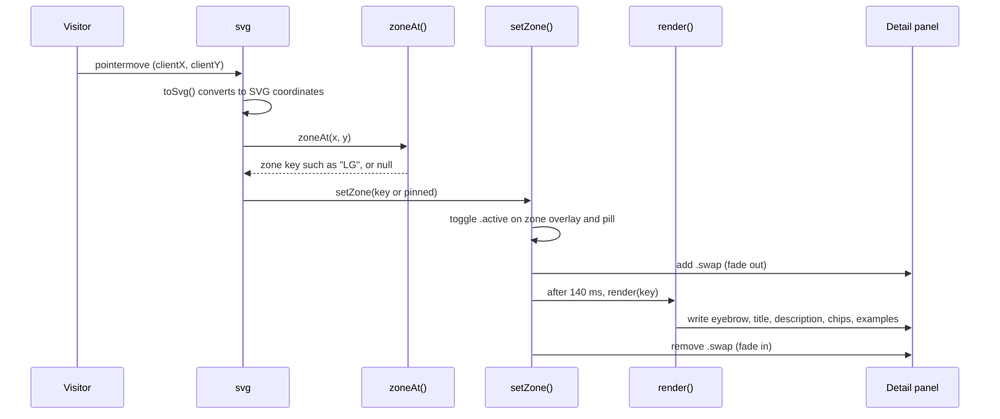

# Architecture

Ikigai is three static files loaded by the browser. `index.html` holds the page layout and the base SVG, `styles.css` handles the look and animations, and `script.js` builds the overlap regions at load time and wires up the interaction.

## Components

There is no build step, bundler, server code, or package manager. The browser loads `index.html`, which pulls in `styles.css` from its `<head>` and runs `script.js` at the end of `<body>`, after the DOM it needs already exists.

## Language breakdown

See [By the numbers](../by-the-numbers.md) for the full snapshot.

## SVG layer stack

The diagram in `index.html` is a stack of SVG groups. Later groups paint on top of earlier ones.

| Order | Group | Filled by | Purpose |
| --- | --- | --- | --- |
| 1 | `<g class="circles">` | `index.html` | Four colored circles, blended with `mix-blend-mode: multiply` so overlaps darken naturally |
| 2 | `<g id="centerFill">` | `script.js` | Gold radial gradient painted only inside the four-way overlap |
| 3 | `<g id="zones">` | `script.js` | One translucent white overlay per region, hidden until it becomes active |
| 4 | `<g class="outlines">` | `index.html` | White circle outlines drawn over the fills |
| 5 | `<g class="labels">` | `index.html` | Circle names, pair names, center label, and the four white dots; `pointer-events: none` |

The masks that shape layers 2 and 3 are explained in [Region rendering](../systems/region-rendering.md).

## Request lifecycle: pointer to panel

There are no network requests after load. The interesting flow is how a pointer event updates the page.

Hit testing is pure math: `zoneAt()` in `script.js` checks the distance from the pointer to each circle center. It does not rely on DOM hit targets, so the overlapping masked groups never compete for events. See [Zone exploration](../features/zone-exploration.md) for the full interaction model.

## Data model at a glance

All content lives in three object literals at the top of `script.js`:

- `CIRCLE`: display name and color variable for each of the four circles.
- `ZONES`: eyebrow, title, and description for each of the 13 regions.
- `EXAMPLES`: three example strings for each region.

Every one of these is keyed by a [zone key](../primitives/zone-keys.md). Field-level details are in [Data models](../reference/data-models.md).

## Key source files

| File | Purpose |
| --- | --- |
| `index.html` | Page layout, base SVG (circles, outlines, labels, gold gradient), detail panel shell, and Explore buttons |
| `script.js` | Zone data, SVG mask generation, hit testing, panel rendering, and event handlers |
| `styles.css` | Design tokens, entrance animations, zone overlay transitions, panel styling, and responsive breakpoints |
