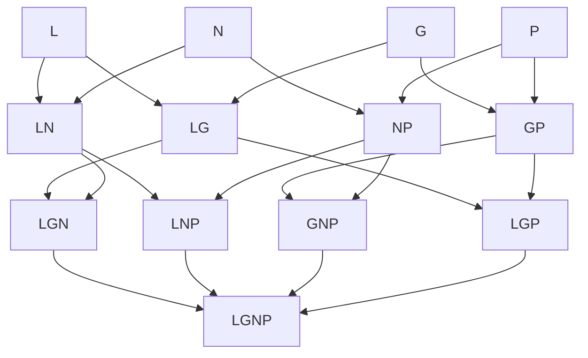

# Zone keys

Active contributors: Franklin Pfaller

## Purpose

A zone key is a short string that names a region of the diagram by listing the circles it sits inside, for example `LG` for "inside Love and Good at, outside the others". Every part of the app uses the same key to find a region's data, its SVG overlay, and its Explore button.

## Format

- Letters come from `ORDER = "LGNP"` in `script.js`: `L` love, `G` good at, `N` world needs, `P` paid for.
- Letters always appear in `L-G-N-P` order. `GL` is never valid. The comment above `ZONES` in `script.js` states this rule.
- A key has one to four letters.

## The 13 valid keys

Four circles allow 15 non-empty combinations, but only 13 exist as regions. The opposite pairs `LP` (top and bottom) and `GN` (left and right) do overlap, but every point in those overlaps is also inside at least one of the other two circles, so there is no "only L and P" region. A pixel scan of the geometry in `script.js` confirms exactly these 13 keys occur.

| Circles | Keys | Names |
| --- | --- | --- |
| One | `L`, `G`, `N`, `P` | The four circle names |
| Two | `LG`, `LN`, `GP`, `NP` | Passion, Mission, Profession, Vocation |
| Three | `LGN`, `LNP`, `GNP`, `LGP` | Delight and fullness but no wealth; Excitement but uncertainty; Comfortable but empty; Satisfaction but uselessness |
| Four | `LGNP` | Ikigai |

## Where keys are used

| Use | File | How |
| --- | --- | --- |
| Content lookup | `script.js` | `ZONES[key]` and `EXAMPLES[key]` |
| Hit testing | `script.js` | `zoneAt()` builds a key by appending letters in `ORDER` order |
| Membership test | `script.js` | `key.includes(k)` decides which chips are on and which circles to exclude in `region()` |
| Mask nesting | `script.js` | `region()` nests one `in-<letter>` mask per letter in the key |
| Overlay lookup | `script.js` | `zoneEls[key]` |
| DOM attribute | `index.html`, `script.js` | `data-zone` on each `.pill` and on each generated overlay group |
| State | `script.js` | `current` and `pinned` hold keys |

## Rules for adding or changing keys

- Any new key must exist in both `ZONES` and `EXAMPLES`, or `render()` will throw when it reads `EXAMPLES[key].map`.
- `zoneAt()` returns `null` for keys missing from `ZONES`, so a region without a `ZONES` entry is treated as empty space and falls back to the pinned zone.
- Pill `data-zone` values must be valid keys in canonical order.

## Related pages

- [Data models](../reference/data-models.md) for the full shape of `ZONES` and `EXAMPLES`.
- [Region rendering](../systems/region-rendering.md) for how keys become SVG masks.
- [Zone exploration](../features/zone-exploration.md) for how keys flow through events.
