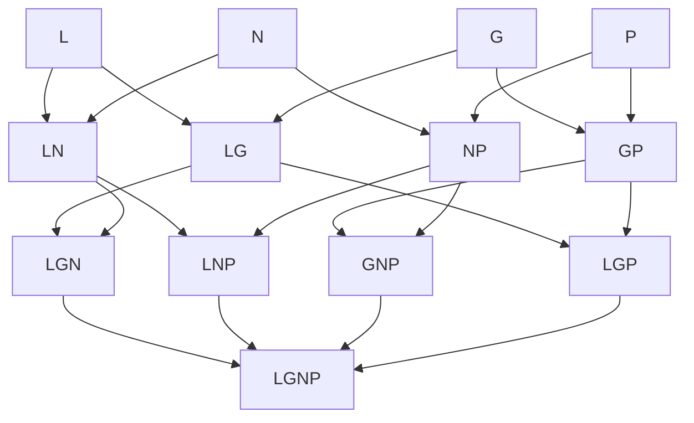

# Zone keys

Active contributors: Franklin Pfaller

## Purpose

A zone key is a short string that names a region of the diagram by listing the circles it sits inside, for example `LG` for "inside Love and Good at, outside the others". Every part of the app uses the same key to find a region's data, its SVG overlay, and its Explore button. In `src/data.ts` the valid keys are a TypeScript union type, `ZoneKey`, so the compiler checks most uses.

## Format

- Letters are the `CircleKey` type (`"L" | "G" | "N" | "P"`) in `src/data.ts`: `L` love, `G` good at, `N` world needs, `P` paid for. `ORDER` (`["L", "G", "N", "P"]`) lists them in canonical order.
- Letters always appear in `L-G-N-P` order. `GL` is never valid, and the `ZoneKey` union does not include it. The comment above `ZoneKey` in `src/data.ts` states this rule.
- A key has one to four letters.

## Type definitions

| Name | Kind | File | Description |
| --- | --- | --- | --- |
| `CircleKey` | type | `src/data.ts` | `"L" \| "G" \| "N" \| "P"` |
| `ZoneKey` | type | `src/data.ts` | Union of the 13 valid key strings |
| `ORDER` | constant | `src/data.ts` | `readonly CircleKey[]`, the circles in canonical order |
| `ZONE_KEYS` | constant | `src/data.ts` | `readonly ZoneKey[]` of all 13 keys; overlay layers are created in this order |
| `isZoneKey(key)` | function | `src/data.ts` | Type guard: returns `true` (narrowing `string` to `ZoneKey`) when `key` is in `ZONE_KEYS` |
| `zoneAt(x, y)` | function | `src/geometry.ts` | Builds a key from a point and returns it as `ZoneKey`, or `null` |

`ZONE_KEYS` and the `ZoneKey` union are maintained by hand and list the same 13 strings. The compiler does not check that they match.

## The 13 valid keys

Four circles allow 15 non-empty combinations, but only 13 exist as regions. The opposite pairs `LP` (top and bottom) and `GN` (left and right) do overlap, but every point in those overlaps is also inside at least one of the other two circles, so there is no "only L and P" region. A pixel scan of the geometry in `src/geometry.ts` (`CENTERS`, `R = 200`) confirms exactly these 13 keys occur.

| Circles | Keys | Names |
| --- | --- | --- |
| One | `L`, `G`, `N`, `P` | The four circle names |
| Two | `LG`, `LN`, `GP`, `NP` | Passion, Mission, Profession, Vocation |
| Three | `LGN`, `LNP`, `GNP`, `LGP` | Delight and fullness but no wealth; Excitement but uncertainty; Comfortable but empty; Satisfaction but uselessness |
| Four | `LGNP` | Ikigai |

## Where keys are used

| Use | File | How |
| --- | --- | --- |
| Content lookup | `src/data.ts`, `src/main.ts` | `ZONES` and `EXAMPLES` are `Record<ZoneKey, ...>`; `render()` reads `ZONES[key]` and `EXAMPLES[key]` |
| Hit testing | `src/geometry.ts` | `zoneAt()` builds a key by appending letters in `ORDER` order, then validates it with `isZoneKey()` |
| Membership test | `src/main.ts` | `key.includes(k)` decides which chips are on and which circles to exclude in `region()` |
| Mask nesting | `src/main.ts` | `region()` nests one `in-<letter>` mask per letter in the key |
| Overlay creation and lookup | `src/main.ts` | Overlays are built by looping over `ZONE_KEYS`; `zoneEls[key]` finds them |
| DOM attribute | `index.html`, `src/main.ts` | `data-zone` on each `.pill` and on each generated overlay group |
| Pill validation | `src/main.ts` | Pill `data-zone` strings pass through `isZoneKey()` before use |
| State | `src/main.ts` | `current` (`ZoneKey \| null`) and `pinned` (`ZoneKey`) hold keys |

## Rules for adding or changing keys

- A new key must be added to the `ZoneKey` union and to `ZONE_KEYS`. If it is in the union but missing from `ZONE_KEYS`, `isZoneKey()` rejects it, so `zoneAt()` treats that region as empty space (falling back to the pinned zone), no overlay is created for it, and a pill with that key does nothing.
- Because `ZONES` and `EXAMPLES` are typed `Record<ZoneKey, ...>`, adding a key to the union without matching entries in both is a type error caught by `tsc --noEmit` in `npm run build` and in CI.
- Pill `data-zone` values in `index.html` are not type-checked. They must be valid keys in canonical order; invalid values are silently ignored at runtime.

## Related pages

- [Data models](../reference/data-models.md) for the full shape of `ZONES` and `EXAMPLES`.
- [Region rendering](../systems/region-rendering.md) for how keys become SVG masks.
- [Zone exploration](../features/zone-exploration.md) for how keys flow through events.
