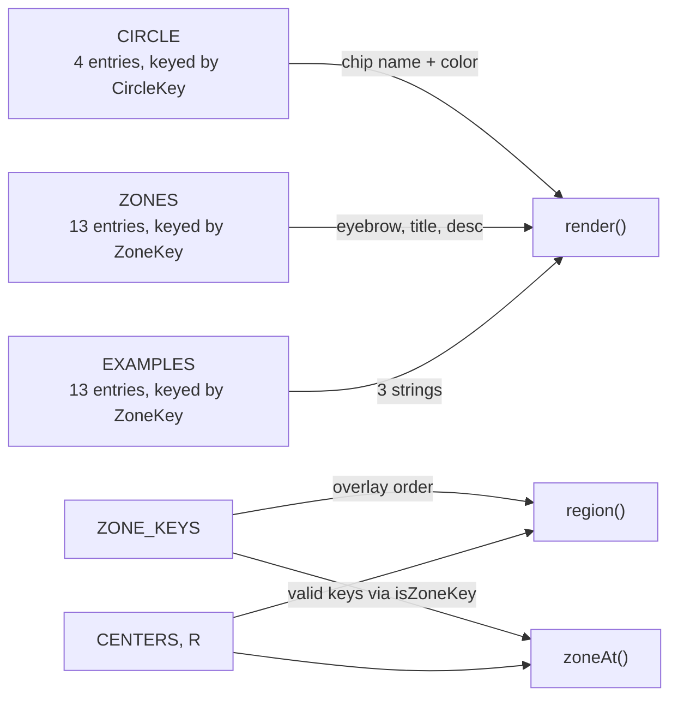

# Data models

All content is stored in typed constants in `src/data.ts`. They are keyed by [zone keys](../primitives/zone-keys.md) or circle letters, and TypeScript checks that every key is present. Circle geometry lives in `src/geometry.ts`.



`render()` and `region()` are in `src/main.ts`; `zoneAt()` is in `src/geometry.ts`.

## Types

All four are exported from `src/data.ts`.

```ts
type CircleKey = "L" | "G" | "N" | "P";

// Keys list the circles a region sits inside, in L-G-N-P order.
type ZoneKey =
  | "L" | "G" | "N" | "P"
  | "LG" | "LN" | "GP" | "NP"
  | "LGN" | "LNP" | "GNP" | "LGP"
  | "LGNP";

interface Circle { name: string; color: string; }
interface Zone   { eyebrow: string; title: string; desc: string; }
```

`ZoneKey` has 13 members. `LP` and `GN` are missing on purpose; see [Zone keys](../primitives/zone-keys.md).

## `ORDER` and `ZONE_KEYS`

| Constant | Type | Value | Used for |
| --- | --- | --- | --- |
| `ORDER` | `readonly CircleKey[]` | `["L", "G", "N", "P"]` | Building zone keys in `zoneAt()`, creating the four `in-` masks, listing chips in `render()` |
| `ZONE_KEYS` | `readonly ZoneKey[]` | `L, G, N, P, LG, LN, GP, NP, LGN, LNP, GNP, LGP, LGNP` | Overlay creation order in `src/main.ts`, toggling `.active` in `setZone()`, and the `isZoneKey()` check |

`isZoneKey(key: string): key is ZoneKey` returns true when `key` is in `ZONE_KEYS`. `zoneAt()` uses it to reject point combinations that are not zones, and the Explore pill handler uses it to validate `data-zone` attributes from `index.html`.

## `CIRCLE`

```ts
const CIRCLE: Record<CircleKey, Circle>
```

| Key | `name` | `color` |
| --- | --- | --- |
| `L` | What you love | `var(--love)` |
| `G` | What you’re good at | `var(--good)` |
| `N` | What the world needs | `var(--needs)` |
| `P` | What you can be paid for | `var(--paid)` |

## `ZONES`

```ts
const ZONES: Record<ZoneKey, Zone>
```

| Key | `eyebrow` | `title` |
| --- | --- | --- |
| `L` | One circle | What you love |
| `G` | One circle | What you’re good at |
| `N` | One circle | What the world needs |
| `P` | One circle | What you can be paid for |
| `LG` | Two circles overlap | Passion |
| `LN` | Two circles overlap | Mission |
| `GP` | Two circles overlap | Profession |
| `NP` | Two circles overlap | Vocation |
| `LGN` | Passion + Mission | Delight and fullness, but no wealth |
| `LNP` | Mission + Vocation | Excitement, but uncertainty |
| `GNP` | Profession + Vocation | Comfortable, but empty |
| `LGP` | Passion + Profession | Satisfaction, but uselessness |
| `LGNP` | All four circles | Ikigai |

`desc` is one or two sentences explaining the zone. Because the type is `Record<ZoneKey, Zone>`, leaving out a zone or adding an unknown key is a type error.

## `EXAMPLES`

```ts
const EXAMPLES: Record<ZoneKey, readonly string[]>
```

Each of the 13 zones has exactly three short examples. The type requires every zone to have an entry but does not enforce the count of three. For instance:

```ts
LG: ["A skilled amateur photographer who shoots just for fun",
     "A home baker whose bread friends rave about",
     "A gifted guitarist who plays only for themselves"],
```

To add a zone, add it to the `ZoneKey` union, to `ZONE_KEYS`, and to both `ZONES` and `EXAMPLES`; `tsc` reports the records that are missing it. See [Pitfalls](../background/pitfalls.md).

## Geometry

Exported from `src/geometry.ts`:

| Export | Type | Value |
| --- | --- | --- |
| `R` | `number` | `200` |
| `CENTERS` | `Record<CircleKey, readonly [number, number]>` | `L: [400, 270]`, `G: [270, 400]`, `N: [530, 400]`, `P: [400, 530]` |
| `zoneAt(x, y)` | `(number, number) => ZoneKey \| null` | Pure-math hit test: collects every circle whose center is within `R` of the point, in `ORDER`, and returns the key if `isZoneKey()` accepts it |

The same centers and radius are hard-coded in the base circles and outlines in `index.html`.

## Runtime state

Module-level variables in `src/main.ts`:

| Variable | Type | Description |
| --- | --- | --- |
| `current` | `ZoneKey \| null` | Zone currently displayed |
| `pinned` | `ZoneKey` | Zone shown when the pointer is not over a region. Starts as `"LGNP"` |
| `swapTimer` | `number \| undefined` | Pending panel render |
| `zoneEls` | `Record<ZoneKey, SVGGElement>` | Overlay groups created by `region()` |
| `uid` | `number` | Counter for unique exclusion mask ids |
