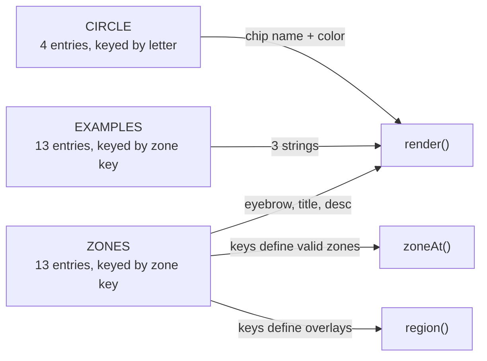

# Data models

All content is stored in three object literals in `script.js`. They are keyed by [zone keys](../primitives/zone-keys.md) or circle letters.



## `CIRCLE`

```js
CIRCLE[letter] = { name: string, color: string }
```

| Key | `name` | `color` |
| --- | --- | --- |
| `L` | What you love | `var(--love)` |
| `G` | What you’re good at | `var(--good)` |
| `N` | What the world needs | `var(--needs)` |
| `P` | What you can be paid for | `var(--paid)` |

## `ZONES`

```js
ZONES[zoneKey] = { eyebrow: string, title: string, desc: string }
```

| Key | `eyebrow` | `title` |
| --- | --- | --- |
| `L` | One circle | What you love |
| `G` | One circle | What you’re good at |
| `N` | One circle | What the world needs |
| `P` | One circle | What you can be paid for |
| `LG` | Two circles overlap | Passion |
| `LN` | Two circles overlap | Mission |
| `GP` | Two circles overlap | Profession |
| `NP` | Two circles overlap | Vocation |
| `LGN` | Passion + Mission | Delight and fullness, but no wealth |
| `LNP` | Mission + Vocation | Excitement, but uncertainty |
| `GNP` | Profession + Vocation | Comfortable, but empty |
| `LGP` | Passion + Profession | Satisfaction, but uselessness |
| `LGNP` | All four circles | Ikigai |

`desc` is one or two sentences explaining the zone. The key set of `ZONES` is also the source of truth for which regions exist: `zoneAt()` ignores keys not in `ZONES`, and the overlay loop creates one overlay per key.

## `EXAMPLES`

```js
EXAMPLES[zoneKey] = [string, string, string]
```

Each of the 13 zones has exactly three short examples. For instance:

```js
LG: ["A skilled amateur photographer who shoots just for fun",
     "A home baker whose bread friends rave about",
     "A gifted guitarist who plays only for themselves"]
```

Every key in `ZONES` must also exist in `EXAMPLES`. See [Pitfalls](../background/pitfalls.md).

## Runtime state

| Variable | Type | Description |
| --- | --- | --- |
| `current` | zone key or `null` | Zone currently displayed |
| `pinned` | zone key | Zone shown when the pointer is not over a region |
| `swapTimer` | timeout id | Pending panel render |
| `zoneEls` | `{ [zoneKey]: SVGGElement }` | Overlay groups created by `region()` |
| `uid` | number | Counter for unique exclusion mask ids |
