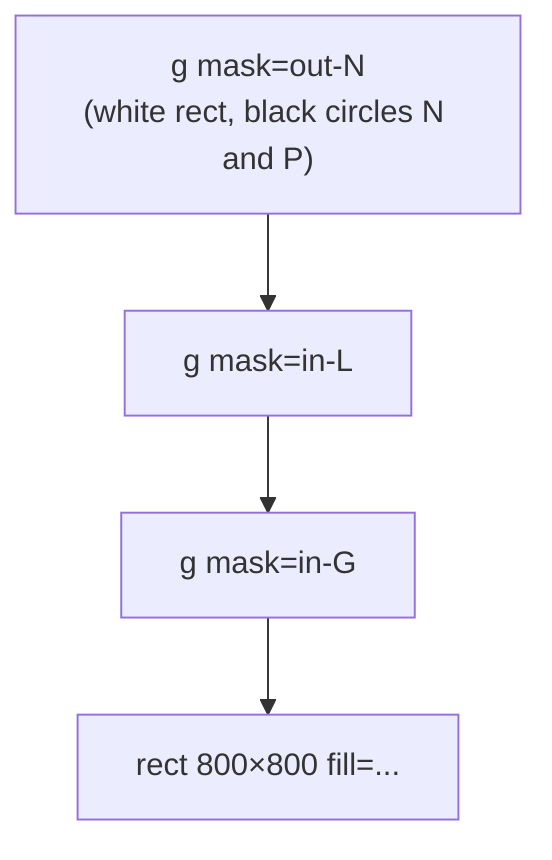
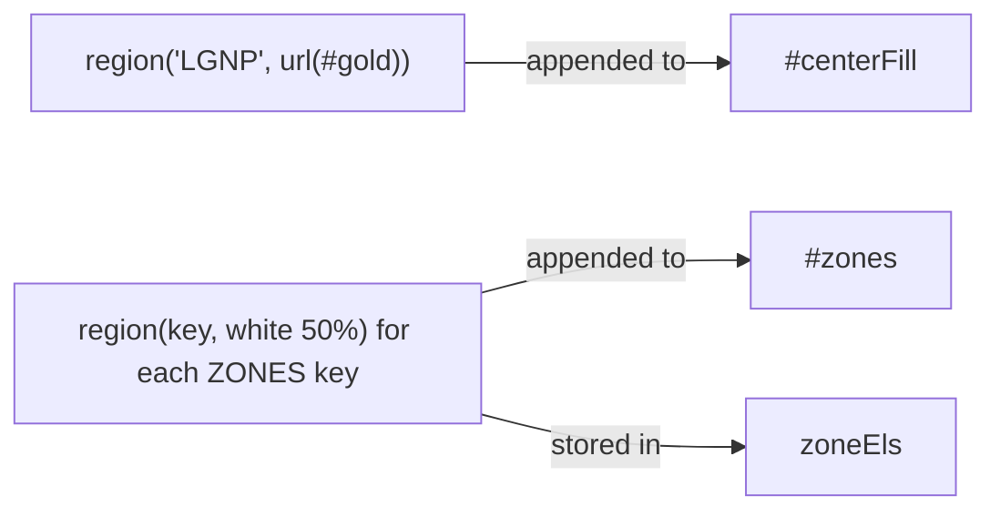

# Region rendering

Active contributors: Franklin Pfaller

## Purpose

SVG has no built-in way to draw "the part of circle A and circle B that is outside circles C and D". Region rendering solves this with SVG masks. At page load, `script.js` generates one masked group per zone so that each zone can be filled and faded independently.

## Directory layout

```text
ikigai/
├── index.html   # <defs id="defs"> with the gold gradient, empty #centerFill and #zones groups
└── script.js    # inclusion masks, region(), and the loop that fills #zones
```

## Key abstractions

| Name | File | Description |
| --- | --- | --- |
| `el(tag, attrs, parent)` | `script.js` | Creates an SVG element with `createElementNS`, sets attributes, and appends it |
| `FULL` | `script.js` | Shared mask attributes: `maskUnits="userSpaceOnUse"` covering 0,0 to 800,800 |
| `in-L`, `in-G`, `in-N`, `in-P` | `script.js` (generated) | Inclusion masks: black everywhere, white inside one circle |
| `region(key, fill, parent, cls)` | `script.js` | Builds a group that paints `fill` only inside zone `key` |
| `#gold` | `index.html` | Radial gradient used for the center Ikigai fill |
| `zoneEls` | `script.js` | Map from zone key to its overlay group |

## How it works

### Step 1: inclusion masks

For each letter in `ORDER`, `script.js` adds a mask to `#defs` with a black 800 × 800 rect and a white circle at that circle's center. Content drawn through mask `in-L` shows only inside circle L.

### Step 2: building a zone with `region()`

For a zone key like `LG`, `region()` builds:



1. An exclusion mask `out-<n>` (a fresh id per call from the `uid` counter): white rect, with a black circle for every circle not in the key. This removes anything inside N or P.
2. An outer `<g>` that uses the exclusion mask and carries `class` and `data-zone`.
3. One nested `<g>` per letter in the key, each using that letter's inclusion mask. Nesting masks intersects them, so only the area inside both L and G survives.
4. A full-size rect with the given fill at the innermost level.

The result is a group that paints only the "inside L and G, outside N and P" region, which is the Passion zone.

### Step 3: the layers



- One call paints the four-way overlap with the `#gold` gradient into `#centerFill`. This is always visible.
- A loop over `ZONES` builds an overlay for each of the 13 zones in `#zones`, with class `zone`. Overlays are white at 50% opacity, except `LGNP`, which uses 35% so the gold stays visible. They start hidden (`opacity: 0` in `styles.css`) and fade in when `setZone()` adds `.active`.

### Why masks and not clip-paths

The comment in `script.js` says it directly: masks keep region edges anti-aliased. Clip-paths in most browsers produce hard, aliased edges, which would show as jagged seams where adjacent zones meet.

### Mask count

At load, the page creates 4 inclusion masks plus 14 exclusion masks (1 for the center fill and 13 for overlays). Every overlay is a full-canvas rect behind up to five mask levels. This is cheap at this scale, and only `opacity` changes during interaction.

## Integration points

- Consumes `C`, `R`, `ORDER`, and the keys of `ZONES` from the top of `script.js`. See [Zone keys](../primitives/zone-keys.md).
- Produces `zoneEls`, which [Zone exploration](../features/zone-exploration.md) uses to toggle highlights.
- Paints into empty groups declared in `index.html`, sandwiched between the base circles and the outlines (see the layer table in [Architecture](../overview/architecture.md)).

## Entry points for modification

To change highlight intensity, edit the fill strings in the `for (const key in ZONES)` loop in `script.js`, or the `.zone` transition in `styles.css`. To give each zone its own fill color instead of a white overlay, pass a different `fill` per key into `region()`. Changing circle geometry requires updating both `C`/`R` here and the circles in `index.html`.

## Key source files

| File | Purpose |
| --- | --- |
| `script.js` | Mask generation, `region()`, and overlay creation |
| `index.html` | `#defs`, `#gold` gradient, and the `#centerFill` and `#zones` target groups |
| `styles.css` | `.zone` and `.zone.active` opacity transition |
