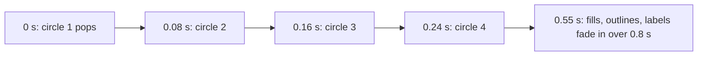

# Visual design

Active contributors: Franklin Pfaller

## Purpose

All styling lives in `styles.css`. It defines the palette and fonts as CSS custom properties, animates the diagram in on load, styles the detail panel, and adapts the layout for tablets and phones.

## Directory layout

```text
ikigai/
├── styles.css   # tokens, layout grid, diagram, panel, media queries
└── index.html   # Google Fonts <link>, SVG fills that reference var(--love) etc.
```

## Key abstractions

| Name | File | Description |
| --- | --- | --- |
| `:root` custom properties | `styles.css` | Background, ink, muted, line colors, four circle colors, serif and sans font stacks |
| `.wrap` | `styles.css` | Two-column grid (diagram 1.3fr, panel 0.7fr, min 300 px), max width 1180 px |
| `@keyframes pop` | `styles.css` | Circle entrance: fade and scale from 0.82 to 1 |
| `@keyframes fade` | `styles.css` | Opacity fade for the center fill, overlays, outlines, and labels |
| `.circle` | `styles.css` | `mix-blend-mode: multiply` and `fill-opacity: 0.82` so overlaps darken like ink |
| `.card` | `styles.css` | Frosted panel: translucent white, `backdrop-filter: blur(8px)`, 22 px radius |

## How it works

### Tokens

| Token | Value | Used for |
| --- | --- | --- |
| `--bg` | `#FBF7F0` | Page background (inside a radial gradient on `body`) |
| `--ink` | `#2A2521` | Body text, labels, active pill |
| `--muted` | `#7A7068` | Kanji, subtitle, eyebrows, note |
| `--line` | `#E8DFD3` | Card, chip, and pill borders |
| `--love` | `#F2A29B` | Circle L |
| `--good` | `#F5C877` | Circle G |
| `--needs` | `#BBA8F0` | Circle N |
| `--paid` | `#8CD6C3` | Circle P |
| `--serif` | Fraunces, Georgia, Times New Roman | Headings, pair labels |
| `--sans` | Inter, system-ui, ... | Body text, circle labels |

Japanese text (`.kanji`, `.label-center-jp`) uses Noto Serif JP directly.

### Entrance sequence



The circles use `transform-box: fill-box` and `transform-origin: center` so each scales from its own center instead of the SVG origin. The `.circles` group has `isolation: isolate` so the multiply blend only mixes the circles with each other, plus a soft `drop-shadow`.

### Responsive layout

| Breakpoint | Change |
| --- | --- |
| > 900 px | Two columns, card `min-height: 580px` |
| ≤ 900 px | Single column, diagram above panel, no card minimum height |
| ≤ 600 px | Tighter padding, and larger SVG label font sizes |

The phone breakpoint enlarges SVG text because the SVG scales down with the viewport, which would otherwise make labels too small to read. The comment above the media query in `styles.css` notes this.

## Integration points

- SVG circle fills in `index.html` and chip dots built by `render()` in `script.js` reference the circle tokens, so changing a token recolors the diagram and the chips together.
- State classes toggled by JavaScript (`.active`, `.swap`, `.hovering`, `.off`) are defined here. See [Zone exploration](../features/zone-exploration.md) and [Detail panel](../features/detail-panel.md).

## Entry points for modification

To retheme, change the `:root` tokens in `styles.css`. To adjust motion, edit the `pop`/`fade` keyframes and their delays. If you change the `.card .content` transition duration, keep the 140 ms timeout in `setZone()` in `script.js` slightly shorter so new content appears while the panel is faded out.

## Key source files

| File | Purpose |
| --- | --- |
| `styles.css` | All tokens, layout, animation, and responsive rules |
| `index.html` | Font loading and token references in SVG fills |
| `script.js` | Inline chip colors from `CIRCLE[k].color` |
